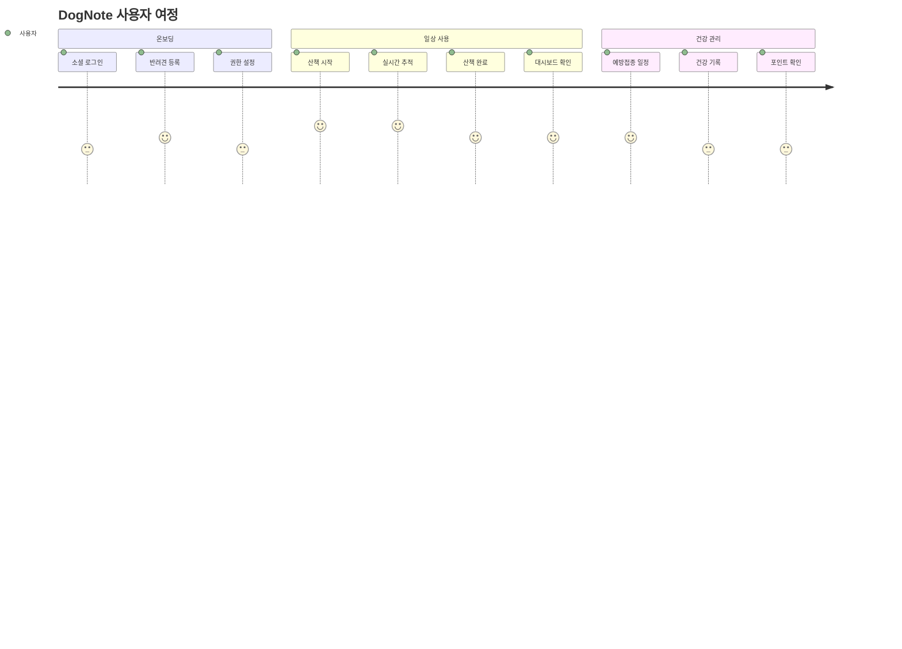
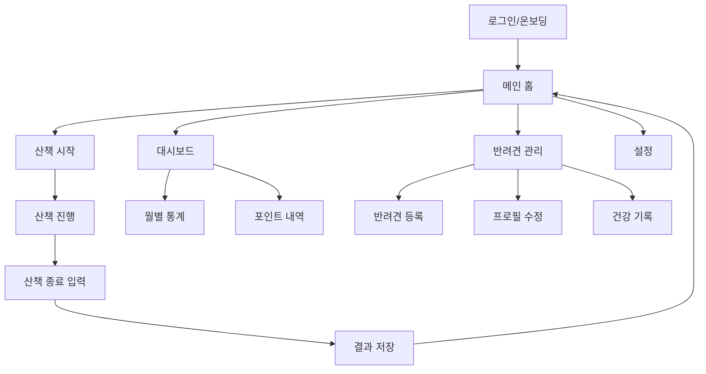
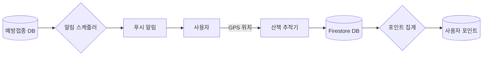

# 🎯 DogNote 기능 명세서 (Functional Requirements Specification)

_버전: 2.0_  
_최종 업데이트: 2025-08-31_  
_승인자: Product Owner, Tech Lead_

---

## 📖 목차

1. [개요](#개요)
2. [제품 비전 및 목표](#제품-비전-및-목표)
3. [사용자 시나리오](#사용자-시나리오)
4. [기능 요구사항](#기능-요구사항)
5. [사용자 경험 플로우](#사용자-경험-플로우)
6. [데이터 흐름](#데이터-흐름)
7. [우선순위 및 릴리스 계획](#우선순위-및-릴리스-계획)
8. [수락 기준](#수락-기준)
9. [제약사항](#제약사항)

---

## 1. 개요

### 1.1 문서 목적

이 문서는 DogNote 애플리케이션의 기능적 요구사항을 정의하고, 개발팀과 이해관계자들이 제품의 기능과
동작을 명확히 이해할 수 있도록 합니다.

### 1.2 대상 독자

- 제품 관리자 (Product Manager)
- 개발팀 (Development Team)
- QA 팀 (Quality Assurance)
- UI/UX 디자이너
- 비즈니스 이해관계자

### 1.3 범위

이 문서는 DogNote MVP 버전의 모든 기능적 요구사항을 다루며, Phase 2 및 향후 계획도 포함합니다.

---

## 2. 제품 비전 및 목표

### 2.1 제품 비전

> 반려견의 일상·건강·산책을 한곳에서 관리하고, 데이터 기반 인사이트와 보상을 제공하는 **"반려견
> 라이프로그 플랫폼"**

### 2.2 비즈니스 목표

- 반려견 건강 관리의 디지털화
- 산책 습관 개선을 통한 반려견 웰빙 증진
- 데이터 기반 맞춤형 케어 서비스 제공
- 반려견 커뮤니티 생태계 구축

### 2.3 성공 지표 (KPIs)

| 지표                   | 목표값  | 측정 주기 |
| ---------------------- | ------- | --------- |
| 월간 활성 사용자 (MAU) | 10,000+ | 월간      |
| 일평균 산책 기록 수    | 500+    | 일간      |
| 사용자 리텐션 (7일)    | 40%+    | 주간      |
| 평균 세션 시간         | 8분+    | 주간      |

### 2.4 대상 플랫폼

- **1단계**: 모바일 웹 (Responsive)
- **2단계**: PWA (Progressive Web App)
- **3단계**: React Native 네이티브 앱

---

## 3. 사용자 시나리오

### 3.1 주요 사용자 페르소나

#### 👩 김미영 (30대, 직장인)

- 골든 리트리버 1마리 반려
- 평일 저녁, 주말 산책
- 건강 관리에 관심 많음
- 디지털 도구 활용 선호

#### 👨 이준호 (40대, 자영업)

- 비글 2마리 반려 (다두 가정)
- 불규칙한 스케줄
- 체계적인 관리 필요
- 간편한 기록 선호

### 3.2 핵심 사용자 여정 (User Journey)



### 3.3 시나리오별 상세 플로우

#### 시나리오 1: 첫 사용 (온보딩)

1. **사용자**가 웹사이트에 접속
2. "Google 로그인" 버튼 클릭으로 계정 생성
3. 첫 반려견 정보 입력 (이름, 품종, 생일, 사진)
4. 위치 권한 및 알림 권한 허용
5. 온보딩 완료 후 메인 대시보드 진입

#### 시나리오 2: 산책 기록

1. **사용자**가 "산책 시작" 버튼 클릭
2. GPS 추적 시작, 실시간 거리/시간 표시
3. 산책 중 특이사항 발생 시 메모 추가
4. "산책 종료" 버튼으로 기록 완료
5. 이슈 체크리스트 작성 및 최종 저장
6. 포인트 적립 알림 표시

#### 시나리오 3: 건강 관리

1. **사용자**가 예방접종 예정일 알림 수신
2. 병원 방문 후 완료 상태로 변경
3. 추가 건강 기록 (체중, 약물 등) 입력
4. 월간 건강 리포트 확인

---

## 4. 기능 요구사항

### 4.1 사용자 인증/계정 (AUTH)

| ID      | 기능          | 설명                                 | 우선순위 | 비고             |
| ------- | ------------- | ------------------------------------ | -------- | ---------------- |
| AUTH-01 | 소셜 로그인   | Google, Apple OAuth 2.0              | Must     | NextAuth.js 사용 |
| AUTH-02 | 세션 관리     | JWT + httpOnly 쿠키, 7일 자동 로그인 | Must     | 보안 강화        |
| AUTH-03 | 카카오 로그인 | Kakao OAuth 추가                     | Should   | Phase 2          |
| AUTH-04 | 로그아웃      | 안전한 세션 종료                     | Must     |                  |
| AUTH-05 | 회원 탈퇴     | 데이터 완전 삭제                     | Must     | GDPR 준수        |

### 4.2 반려견 프로필 관리 (DOG)

| ID     | 기능             | 설명                         | 우선순위 | 비고             |
| ------ | ---------------- | ---------------------------- | -------- | ---------------- |
| DOG-01 | 반려견 등록      | 이름, 품종, 생일, 체중, 사진 | Must     |                  |
| DOG-02 | 다중 반려견 지원 | 무제한 등록, 헤더 스위칭     | Must     |                  |
| DOG-03 | 프로필 수정      | 정보 업데이트                | Must     |                  |
| DOG-04 | 프로필 삭제      | 개별 반려견 삭제             | Must     | 연관 데이터 처리 |
| DOG-05 | 아바타 관리      | 이미지 업로드/변경           | Should   | Firebase Storage |

### 4.3 산책 기록 (WALK)

| ID      | 기능             | 설명                          | 우선순위 | 비고              |
| ------- | ---------------- | ----------------------------- | -------- | ----------------- |
| WALK-01 | 산책 시작        | GPS 추적 시작, startedAt 기록 | Must     |                   |
| WALK-02 | 실시간 추적      | 거리, 시간, 경로 표시         | Must     | 하버사인 알고리즘 |
| WALK-03 | 산책 취소        | 확인 다이얼로그 후 draft 삭제 | Must     | 2초 내 취소       |
| WALK-04 | 산책 종료        | 이슈, 메모 입력 후 저장       | Must     |                   |
| WALK-05 | 다중 반려견 선택 | 동시 산책 기록                | Should   | dogIds[] 배열     |
| WALK-06 | 지도 표시        | 실시간 polyline, 경로 요약    | Could    | Leaflet 사용      |
| WALK-07 | 산책 이력 조회   | 날짜별, 반려견별 필터링       | Must     |                   |

### 4.4 산책 대시보드 (DASH)

| ID      | 기능             | 설명                    | 우선순위 | 비고 |
| ------- | ---------------- | ----------------------- | -------- | ---- |
| DASH-01 | 월별 거리 그래프 | Recharts 막대 차트      | Must     |      |
| DASH-02 | 주간 빈도 메시지 | 산책 횟수 기반 권장사항 | Must     |      |
| DASH-03 | 포인트 표시      | 누적, 월간 포인트       | Must     |      |
| DASH-04 | 최근 산책 리스트 | 최신 2건 + "더보기"     | Must     |      |
| DASH-05 | 통계 요약        | 총 거리, 평균 시간 등   | Should   |      |

### 4.5 건강 & 예방접종 (HEALTH)

| ID        | 기능          | 설명                      | 우선순위 | 비고            |
| --------- | ------------- | ------------------------- | -------- | --------------- |
| HEALTH-01 | 건강 기록     | 체중, 약물, 메모 등       | Should   |                 |
| VACC-01   | 예방접종 일정 | 백신명, 예정일, 완료 여부 | Must     |                 |
| VACC-02   | 예방접종 알림 | 7일 전 FCM/WebPush        | Must     | Cloud Functions |
| CLINIC-01 | 병원 연동     | 병원 시스템 API 동기화    | Could    | Phase 2         |

### 4.6 포인트 & 보상 시스템 (POINT)

| ID     | 기능        | 설명                  | 우선순위 | 비고            |
| ------ | ----------- | --------------------- | -------- | --------------- |
| PTS-01 | 포인트 적립 | 100m당 1pt, 자동 계산 | Must     | Cloud Functions |
| PTS-02 | 포인트 조회 | 월별, 총 포인트 표시  | Must     |                 |
| PTS-03 | 포인트 상점 | 굿즈 교환, 기부       | Could    | Phase 2         |

### 4.7 알림/푸시 (NOTIFICATION)

| ID      | 기능          | 설명               | 우선순위 | 비고        |
| ------- | ------------- | ------------------ | -------- | ----------- |
| NOTI-01 | 예방접종 알림 | 푸시 알림          | Must     |             |
| NOTI-02 | 주간 리포트   | 이메일 리포트      | Should   | 매주 월요일 |
| NOTI-03 | 산책 권장     | 비활성 사용자 대상 | Could    |             |

### 4.8 설정 & 시스템 (SETTING)

| ID     | 기능      | 설명                | 우선순위 | 비고 |
| ------ | --------- | ------------------- | -------- | ---- |
| SET-01 | 언어 설정 | 한국어, 영어 지원   | Could    | i18n |
| SET-02 | 계정 탈퇴 | 완전한 데이터 삭제  | Must     |      |
| SET-03 | 다크 모드 | Tailwind 다크 테마  | Should   |      |
| SET-04 | 알림 설정 | 푸시 알림 세부 설정 | Should   |      |

---

## 5. 사용자 경험 플로우

### 5.1 화면 정의 및 네비게이션



### 5.2 주요 화면별 기능

#### 5.2.1 홈 화면

- 선택된 반려견 썸네일 및 기분 표시
- 빠른 실행: "산책 시작" CTA 버튼
- 최근 일정 및 알림 배지 (1-2개)
- 하단 네비게이션: 홈, 대시보드, 반려견, 설정

#### 5.2.2 산책 진행 화면

- 실시간 거리/시간 표시 (큰 글씨)
- 현재 속도 및 예상 칼로리
- 지도 (선택사항)
- 하단 고정: 일시정지, 취소, 종료 버튼

#### 5.2.3 대시보드

- 월별 거리 그래프 (Recharts)
- 주간 산책 빈도 메시지
- 포인트 현황 (누적/월간)
- 최근 산책 기록 카드 (2개 + 더보기)

---

## 6. 데이터 흐름

### 6.1 시스템 데이터 흐름도



### 6.2 데이터 저장소별 역할

| 저장소               | 용도              | 데이터 유형              |
| -------------------- | ----------------- | ------------------------ |
| **Firestore**        | 메인 데이터베이스 | 사용자, 반려견, 산책기록 |
| **Firebase Storage** | 파일 저장소       | 반려견 사진, 아바타      |
| **Cloud Functions**  | 서버리스 로직     | 포인트 계산, 알림 발송   |
| **FCM**              | 푸시 알림         | 예방접종, 리포트 알림    |

---

## 7. 우선순위 및 릴리스 계획

### 7.1 릴리스 로드맵

| 단계        | 기간 | 포함 기능                                                            | 목표           |
| ----------- | ---- | -------------------------------------------------------------------- | -------------- |
| **MVP 1.0** | 4주  | AUTH-01~02, DOG-01~03, WALK-01~04, DASH-01~04, VACC-01~02, PTS-01~02 | 핵심 기능 완성 |
| **Phase 2** | 6주  | AUTH-03, WALK-05~06, HEALTH-01, NOTI-02, SET-03                      | 확장 기능      |
| **Phase 3** | 8주  | 모바일 앱, 오프라인 모드, 고급 분석                                  | 플랫폼 확장    |

### 7.2 우선순위 매트릭스

```mermaid
quadrant-chart
    title 기능 우선순위 매트릭스
    x-axis Low Impact --> High Impact
    y-axis Low Effort --> High Effort

    quadrant-1 Quick Wins
    quadrant-2 Major Projects
    quadrant-3 Fill-ins
    quadrant-4 Thankless Tasks

    소셜 로그인: [0.9, 0.3]
    산책 추적: [0.95, 0.7]
    대시보드: [0.8, 0.4]
    포인트 시스템: [0.6, 0.5]
    다중 반려견: [0.7, 0.6]
    지도 표시: [0.5, 0.8]
```

---

## 8. 수락 기준 (Acceptance Criteria)

### 8.1 공통 수락 기준

모든 기능은 다음 기준을 충족해야 합니다:

- **성능**: FCP 2초 이하 (모바일 4G 기준)
- **접근성**: WCAG 2.1 AA 준수
- **보안**: 사용자 데이터 암호화 및 격리
- **호환성**: Chrome 90+, Safari 14+, Firefox 88+
- **반응형**: 320px ~ 1920px 모든 해상도 지원

### 8.2 기능별 상세 수락 기준

#### AUTH-01: 소셜 로그인

- **Given**: 사용자가 로그인 페이지에 접속했을 때
- **When**: "Google 로그인" 버튼을 클릭하면
- **Then**:
  - Google OAuth 팝업이 열림
  - 성공 시 메인 페이지로 리다이렉트
  - 실패 시 적절한 에러 메시지 표시
  - 세션이 7일간 유지됨

#### WALK-01: 산책 시작

- **Given**: 사용자가 로그인하고 반려견이 등록되어 있을 때
- **When**: "산책 시작" 버튼을 클릭하면
- **Then**:
  - GPS 권한 요청 (미허용 시)
  - 실시간 거리 측정 시작
  - 시작 시간 기록
  - 취소/종료 버튼 활성화

### 8.3 성능 수락 기준

| 메트릭  | 목표    | 측정 도구  |
| ------- | ------- | ---------- |
| **FCP** | < 2초   | Lighthouse |
| **LCP** | < 2.5초 | Web Vitals |
| **CLS** | < 0.1   | Web Vitals |
| **TTI** | < 3초   | Lighthouse |

---

## 9. 제약사항

### 9.1 기술적 제약사항

- iOS Safari에서 백그라운드 GPS 제약 → PWA 한계 존재
- 무료 Firebase 플랜 한도: 50k reads/day, 20k writes/day
- GPS 정확도: 도심 지역에서 오차 발생 가능
- 오프라인 모드: 제한적 지원 (읽기 전용)

### 9.2 비즈니스 제약사항

- GDPR, 개인정보보호법 준수 필수
- 반려동물 관련 의료 조언 제공 불가
- 광고 없는 무료 서비스 (수익화 Phase 2)
- 한국어 서비스 우선, 다국어 지원은 향후 검토

### 9.3 사용자 경험 제약사항

- 최소 지원 화면 크기: 320px (iPhone SE)
- 인터넷 연결 필수 (오프라인 제한적)
- 위치 권한 거부 시 핵심 기능 제한
- 배터리 소모 최적화 필요 (GPS 사용)

---

## 📎 부록

### A. 용어 사전

- **산책 세션**: 시작부터 종료까지의 완전한 산책 기록
- **포인트**: 산책 거리 기반 보상 시스템 (100m = 1pt)
- **다두 가정**: 2마리 이상의 반려견을 키우는 가정
- **드래프트**: 시작했으나 완료되지 않은 산책 기록

### B. 참고 문서

- [기술 명세서](./technical-specifications.md)
- [UI/UX 가이드라인](../03-design/design-system.md)
- [API 문서](../04-development/api-documentation.md)

---

_이 문서는 지속적으로 업데이트되며, 모든 변경사항은 change-log.md에 기록됩니다._

**승인 이력:**

- v1.0: 2025-08-03 (초기 작성)
- v2.0: 2025-08-31 (GlobalRules 표준 적용, 구현 현황 반영)
