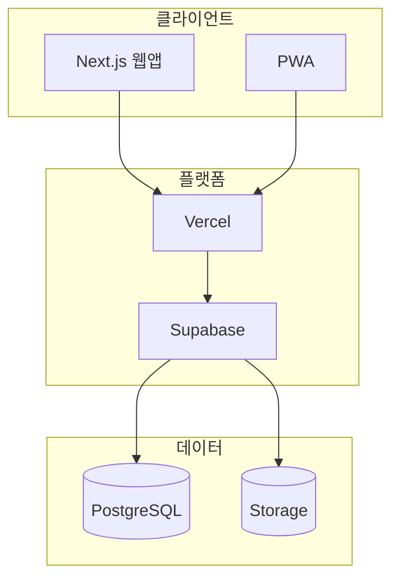

# 🏗️ DogNote 기술 명세서 (Technical Requirements Specification)

_버전: 3.0_  
_최종 업데이트: 2025-04-05_  
_기술 스택: Next.js + Supabase_

---

## 📖 목차

1. [개요](#개요)
2. [시스템 아키텍처](#시스템-아키텍처)
3. [기술 스택](#기술-스택)
4. [데이터 아키텍처](#데이터-아키텍처)
5. [보안 아키텍처](#보안-아키텍처)
6. [성능 요구사항](#성능-요구사항)
7. [개발 환경](#개발-환경)
8. [배포 및 CI/CD](#배포-및-cicd)
9. [모니터링](#모니터링)

---

## 1. 개요

### 1.1 시스템 개요

DogNote는 반려견 라이프로그 플랫폼으로, **Supabase BaaS + Next.js** 기반의 모던 웹
애플리케이션입니다:

- **모바일 퍼스트**: 반응형 웹 → PWA 순차적 확장
- **Supabase BaaS**: PostgreSQL 기반 서버리스 아키텍처
- **실시간 GPS 추적**: 정확한 위치 기반 서비스 제공
- **관계형 데이터**: SQL 기반 데이터 모델링

### 1.2 기술적 목표

| 목표            | 측정 기준       | 기대값               |
| --------------- | --------------- | -------------------- |
| **개발 속도**   | Time to Market  | MVP 4주 이내         |
| **성능**        | Core Web Vitals | FCP < 2s, LCP < 2.5s |
| **확장성**      | 동시 사용자     | 10,000 DAU 지원      |
| **안정성**      | SLA             | 99.5% 가용성         |
| **타입 안정성** | Type Coverage   | 100%                 |

---

## 2. 시스템 아키텍처

### 2.1 전체 아키텍처



### 2.2 디렉터리 구조

```
src/
├── app/                 # Next.js App Router
├── components/
│   ├── ui/              # 기본 UI 컴포넌트
│   ├── features/        # 도메인별 컴포넌트
│   └── layouts/         # 레이아웃
├── hooks/               # 커스텀 훅
├── lib/
│   ├── supabase/        # Supabase 클라이언트
│   │   ├── client.ts
│   │   └── server.ts
│   └── utils/           # 유틸리티 함수
├── services/            # 비즈니스 로직
└── types/               # 타입 정의
```

---

## 3. 기술 스택

### 3.1 프론트엔드

| 기술         | 버전   | 용도                |
| ------------ | ------ | ------------------- |
| Next.js      | 14.x   | App Router, SSR/SSG |
| React        | 18.x   | UI 라이브러리       |
| TypeScript   | 5.x    | 타입 시스템         |
| Tailwind CSS | 3.x    | 스타일링            |
| Radix UI     | 1.x    | Headless 컴포넌트   |
| shadcn/ui    | latest | UI 컴포넌트         |

### 3.2 상태 관리

| 기술           | 용도                 |
| -------------- | -------------------- |
| Zustand        | 글로벌 상태 관리     |
| TanStack Query | 서버 상태 관리, 캐싱 |

### 3.3 백엔드 (BaaS)

| 기술          | 용도                                      |
| ------------- | ----------------------------------------- |
| Supabase      | PostgreSQL, Auth, Storage, Edge Functions |
| PostgreSQL 15 | 관계형 데이터베이스                       |
| PostgREST     | 자동 REST API                             |
| GoTrue        | JWT 인증                                  |

### 3.4 주요 의존성

```json
{
  "dependencies": {
    "next": "^14.0.0",
    "react": "^18.2.0",
    "typescript": "^5.0.0",
    "@supabase/supabase-js": "^2.39.0",
    "@tanstack/react-query": "^5.0.0",
    "zustand": "^4.4.0",
    "tailwindcss": "^3.4.0"
  },
  "devDependencies": {
    "vitest": "^1.0.0",
    "@testing-library/react": "^14.0.0",
    "eslint": "^8.0.0",
    "prettier": "^3.0.0"
  }
}
```

---

## 4. 데이터 아키텍처

### 4.1 데이터베이스 선택

**PostgreSQL (Supabase)**

- 관계형 데이터 모델링
- ACID 트랜잭션 지원
- Row Level Security (RLS)
- JSONB 필드로 유연성 확보

### 4.2 핵심 테이블

| 테이블             | 설명        | 주요 필드                              |
| ------------------ | ----------- | -------------------------------------- |
| dogs               | 반려견 정보 | name, breed, weight, profile_image_url |
| walks              | 산책 기록   | start_time, distance, route(jsonb)     |
| health_records     | 건강 기록   | type, weight, recorded_at              |
| vaccinations       | 예방접종    | vaccine_name, scheduled_date           |
| point_transactions | 포인트      | points, type, description              |

### 4.3 데이터 접근 패턴

```typescript
// Supabase Client 사용
const supabase = createClient(
  process.env.NEXT_PUBLIC_SUPABASE_URL!,
  process.env.NEXT_PUBLIC_SUPABASE_ANON_KEY!
);

// Query
const { data, error } = await supabase
  .from('walks')
  .select('*')
  .eq('dog_id', dogId)
  .order('start_time', { ascending: false });

// Insert
const { data } = await supabase
  .from('walks')
  .insert({ dog_id: dogId, start_time: new Date() })
  .select()
  .single();
```

---

## 5. 보안 아키텍처

### 5.1 인증 흐름

| 단계         | 기술                  | 설명                |
| ------------ | --------------------- | ------------------- |
| 1. 로그인    | OAuth (Google, Apple) | 소셜 로그인         |
| 2. JWT 발급  | Supabase Auth         | Access/Refresh 토큰 |
| 3. 세션 관리 | httpOnly 쿠키         | XSS 방지            |
| 4. 인증 검증 | Next.js Middleware    | 페이지 보호         |

### 5.2 데이터 보안 (RLS)

```sql
-- 사용자별 데이터 격리
CREATE POLICY "Users can only access their own dogs"
  ON dogs FOR ALL
  USING (auth.uid() = user_id);
```

### 5.3 보안 체크리스트

- [x] 모든 테이블 RLS 활성화
- [x] OAuth Provider 설정
- [x] CORS 설정
- [x] 환경 변수 보안
- [ ] Rate Limiting 적용 예정

---

## 6. 성능 요구사항

### 6.1 Core Web Vitals

| 지표 | 목표    | 우선순위 |
| ---- | ------- | -------- |
| FCP  | < 1.8s  | Must     |
| LCP  | < 2.5s  | Must     |
| CLS  | < 0.1   | Must     |
| INP  | < 200ms | Should   |

### 6.2 최적화 전략

| 영역   | 전략                                   |
| ------ | -------------------------------------- |
| 이미지 | Next.js Image 컴포넌트, WebP 포맷      |
| 캐싱   | TanStack Query staleTime 설정          |
| 코드   | 동적 import, 코드 스플리팅             |
| 데이터 | 데이터 prefetching, optimistic updates |

---

## 7. 개발 환경

### 7.1 요구사항

- **Node.js**: 18.17.0+ (권장: 20.x LTS)
- **npm**: 9.x+
- **Git**: 2.30+

### 7.2 스크립트

```bash
npm run dev          # 개발 서버
npm run build        # 프로덕션 빌드
npm run lint         # ESLint 검사
npm run type-check   # TypeScript 검사
npm run test         # 테스트 실행
```

### 7.3 환경 변수

```bash
# 필수
NEXT_PUBLIC_SUPABASE_URL=
NEXT_PUBLIC_SUPABASE_ANON_KEY=
SUPABASE_SERVICE_ROLE_KEY=

# 선택
NEXT_PUBLIC_APP_ENV=development
NEXT_PUBLIC_APP_URL=http://localhost:3000
```

---

## 8. 배포 및 CI/CD

### 8.1 배포 플랫폼

| 환경     | 플랫폼            | 특징            |
| -------- | ----------------- | --------------- |
| 개발     | Vercel Preview    | 자동 배포       |
| 스테이징 | Vercel            | 프로덕션과 동일 |
| 프로덕션 | Vercel + Supabase | 안정적 배포     |

### 8.2 CI/CD 파이프라인

```yaml
# GitHub Actions 예시
name: CI/CD
on:
  push:
    branches: [main, develop]
jobs:
  test:
    runs-on: ubuntu-latest
    steps:
      - uses: actions/checkout@v4
      - uses: actions/setup-node@v4
      - run: npm ci
      - run: npm run lint
      - run: npm run type-check
      - run: npm run test
  deploy:
    needs: test
    runs-on: ubuntu-latest
    steps:
      - uses: actions/checkout@v4
      - run: npm ci
      - run: npm run build
      # Vercel 배포
```

---

## 9. 모니터링

### 9.1 도구

| 도구               | 용도                 |
| ------------------ | -------------------- |
| Vercel Analytics   | Web Vitals, 트래픽   |
| Supabase Dashboard | DB 성능, Auth 상태   |
| web-vitals         | 클라이언트 성능 수집 |

### 9.2 알림

- 에러율 > 1%: Slack 알림
- DB CPU > 80%: 이메일 알림
- API 에러율: 자동 모니터링

---

**문서 히스토리:**

- v3.0: 2025-04-05 - Supabase 기술 스택으로 업데이트
- v2.0: 2025-08-31 - Firebase 기준 기술 명세
- v1.0: 2025-01-16 - 초안 작성
