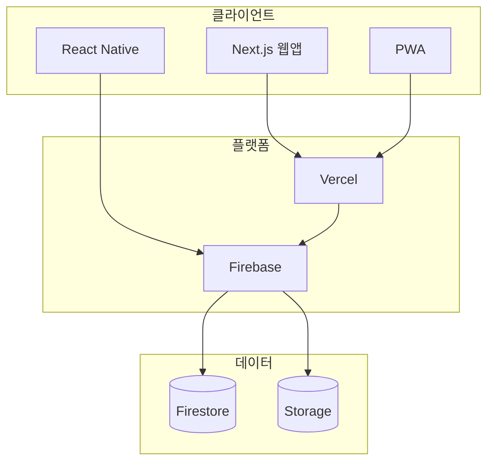
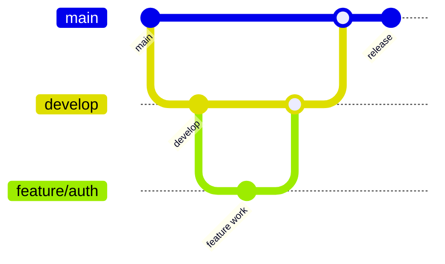

# 🏗️ DogNote 기술 명세서 (Technical Requirements Specification)

_버전: 2.0_  
_최종 업데이트: 2025-08-31_  
_승인자: Tech Lead, DevOps Engineer_

---

## 📖 목차

1. [개요](#개요)
2. [시스템 아키텍처](#시스템-아키텍처)
3. [기술 스택](#기술-스택)
4. [데이터 아키텍처](#데이터-아키텍처)
5. [보안 아키텍처](#보안-아키텍처)
6. [성능 요구사항](#성능-요구사항)
7. [개발 환경](#개발-환경)
8. [배포 및 CI/CD](#배포-및-cicd)
9. [모니터링](#모니터링)
10. [제약사항](#제약사항)

---

## 1. 개요

### 1.1 시스템 개요

DogNote는 반려견 라이프로그 플랫폼으로, 다음과 같은 기술적 특징을 가집니다:

- **모바일 퍼스트**: 반응형 웹 → PWA → 네이티브 앱 순차적 확장
- **Firebase BaaS**: 빠른 MVP 구축을 위한 서버리스 아키텍처
- **실시간 GPS 추적**: 정확한 위치 기반 서비스 제공
- **확장 가능한 다중 테넌트**: 사용자별 데이터 격리

### 1.2 기술적 목표

| 목표               | 측정 기준       | 기대값               |
| ------------------ | --------------- | -------------------- |
| **빠른 개발 속도** | Time to Market  | MVP 4주 이내         |
| **높은 성능**      | Core Web Vitals | FCP < 2s, LCP < 2.5s |
| **확장성**         | 동시 사용자     | 10,000 DAU 지원      |
| **안정성**         | SLA             | 99.5% 가용성         |

---

## 2. 시스템 아키텍처

### 2.1 전체 아키텍처



### 2.2 디렉터리 구조

```
src/
├── app/                 # Next.js App Router
├── components/
│   ├── ui/              # 기본 UI 컴포넌트
│   ├── features/        # 도메인별 컴포넌트
│   ├── layouts/         # 레이아웃
│   └── providers/       # Context Providers
├── hooks/               # 커스텀 훅
├── lib/
│   ├── firebase.ts      # Firebase 초기화
│   ├── geoutils.ts      # GPS 유틸리티
│   └── api/             # API 래퍼
├── services/            # 비즈니스 로직
├── types/               # 타입 정의
└── utils/               # 유틸리티 함수
```

---

## 3. 기술 스택

### 3.1 프론트엔드

| 카테고리        | 기술                 | 버전  | 선택 이유                          |
| --------------- | -------------------- | ----- | ---------------------------------- |
| **프레임워크**  | Next.js              | 14.x  | App Router, SSR/SSG, Vercel 최적화 |
| **언어**        | TypeScript           | 5.x   | 타입 안전성, 개발 생산성           |
| **UI**          | React                | 18.x  | 생태계, 성능, 개발자 경험          |
| **스타일링**    | Tailwind CSS         | 3.x   | 유틸리티 우선, 빠른 개발           |
| **컴포넌트**    | Radix UI + shadcn/ui | 1.x   | 접근성, 재사용성                   |
| **상태관리**    | Zustand              | 4.x   | 경량, 간단한 API                   |
| **데이터 패칭** | TanStack Query       | 5.x   | 캐싱, 백그라운드 업데이트          |
| **지도**        | Leaflet              | 1.9.x | 오픈소스, 커스터마이징             |

### 3.2 백엔드 서비스

| 서비스               | 용도          | 특징                         |
| -------------------- | ------------- | ---------------------------- |
| **Firestore**        | 메인 DB       | NoSQL, 실시간, 오프라인 지원 |
| **Firebase Auth**    | 인증          | 소셜 로그인, JWT             |
| **Cloud Functions**  | 서버리스 로직 | 트리거, 백그라운드 작업      |
| **Firebase Storage** | 파일 저장     | 이미지 업로드, CDN           |
| **FCM**              | 푸시 알림     | 멀티 플랫폼 지원             |

---

## 4. 데이터 아키텍처

### 4.1 Firestore 스키마

```typescript
// 컬렉션 구조
interface Collections {
  users: {
    [uid: string]: User;
    subcollections: {
      dogs: {
        [dogId: string]: Dog;
        subcollections: {
          walks: { [walkId: string]: Walk };
          healthRecords: { [recordId: string]: HealthRecord };
          vaccinations: { [vaccId: string]: Vaccination };
        };
      };
    };
  };
}

interface User {
  displayName: string;
  email: string;
  createdAt: Timestamp;
  onboardingCompleted: boolean;
  totalPoints: number;
}

interface Dog {
  name: string;
  breed: string;
  birthDate: Timestamp;
  weightKg: number;
  avatarUrl?: string;
  mood: 'happy' | 'normal' | 'sad' | 'sick';
}

interface Walk {
  startedAt: Timestamp;
  endedAt?: Timestamp;
  distanceMeters: number;
  durationMinutes: number;
  issues: string[];
  note?: string;
  pointsEarned: number;
  status: 'draft' | 'completed';
  dogIds: string[];
}
```

### 4.2 인덱싱 전략

```json
{
  "indexes": [
    {
      "collectionGroup": "walks",
      "fields": [
        { "fieldPath": "userId", "order": "ASCENDING" },
        { "fieldPath": "startedAt", "order": "DESCENDING" }
      ]
    },
    {
      "collectionGroup": "walks",
      "fields": [
        { "fieldPath": "dogIds", "arrayConfig": "CONTAINS" },
        { "fieldPath": "startedAt", "order": "DESCENDING" }
      ]
    }
  ]
}
```

---

## 5. 보안 아키텍처

### 5.1 Firestore 보안 규칙

```javascript
rules_version = '2';
service cloud.firestore {
  match /databases/{database}/documents {
    function isAuthenticated() {
      return request.auth != null;
    }

    function isOwner(uid) {
      return request.auth.uid == uid;
    }

    match /users/{uid} {
      allow read, write: if isAuthenticated() && isOwner(uid);

      match /dogs/{dogId} {
        allow read, write: if isAuthenticated() && isOwner(uid);

        match /{subcollection}/{docId} {
          allow read, write: if isAuthenticated() && isOwner(uid);
        }
      }
    }
  }
}
```

### 5.2 보안 요소

| 요소            | 구현 방법                | 세부사항             |
| --------------- | ------------------------ | -------------------- |
| **전송 암호화** | HTTPS/TLS 1.3            | 모든 통신 암호화     |
| **저장 암호화** | Firebase 기본            | AES-256              |
| **인증**        | Firebase Auth + NextAuth | 소셜 로그인          |
| **세션 관리**   | JWT + HttpOnly Cookie    | 7일 만료             |
| **입력 검증**   | Zod Schema               | 클라이언트/서버 양쪽 |

---

## 6. 성능 요구사항

### 6.1 성능 목표

| 메트릭  | 목표값  | 측정 도구  |
| ------- | ------- | ---------- |
| **FCP** | < 2초   | Lighthouse |
| **LCP** | < 2.5초 | Web Vitals |
| **CLS** | < 0.1   | Web Vitals |
| **FID** | < 100ms | Web Vitals |

### 6.2 최적화 전략

```typescript
// 코드 스플리팅
const DashboardPage = lazy(() => import('./pages/DashboardPage'));

// 이미지 최적화
import Image from 'next/image';
<Image
  src="/avatar.jpg"
  width={100}
  height={100}
  loading="lazy"
  placeholder="blur"
/>

// 메모화
const DogCard = memo(({ dog, onSelect }: DogCardProps) => (
  <Card onClick={() => onSelect(dog.id)}>
    {dog.name}
  </Card>
));
```

---

## 7. 개발 환경

### 7.1 로컬 개발 설정

```bash
# 프로젝트 설정
npm install
npm run dev

# Firebase 에뮬레이터
firebase init emulators
firebase emulators:start
```

### 7.2 환경별 구성

| 환경         | URL            | DB       | 특징           |
| ------------ | -------------- | -------- | -------------- |
| **개발**     | localhost:3000 | Emulator | Hot reload     |
| **스테이징** | staging.app    | Test DB  | 운영 동일 환경 |
| **운영**     | dognote.app    | Prod DB  | 고가용성       |

---

## 8. 배포 및 CI/CD

### 8.1 브랜치 전략



### 8.2 GitHub Actions

```yaml
name: CI/CD Pipeline
on:
  pull_request:
    branches: [develop, main]
  push:
    branches: [main]

jobs:
  test:
    runs-on: ubuntu-latest
    steps:
      - uses: actions/checkout@v3
      - uses: actions/setup-node@v3
      - run: npm ci
      - run: npm run lint
      - run: npm run test

  deploy:
    needs: test
    if: github.ref == 'refs/heads/main'
    runs-on: ubuntu-latest
    steps:
      - uses: actions/checkout@v3
      - uses: vercel/action@v20
```

---

## 9. 모니터링

### 9.1 로깅 시스템

```typescript
interface LogEntry {
  timestamp: string;
  level: 'info' | 'warn' | 'error';
  message: string;
  userId?: string;
  metadata?: Record<string, any>;
}

export const logger = {
  info: (message: string, meta?: any) => {
    const entry: LogEntry = {
      timestamp: new Date().toISOString(),
      level: 'info',
      message,
      metadata: meta,
      userId: getCurrentUserId(),
    };

    console.log(JSON.stringify(entry));
    if (process.env.NODE_ENV === 'production') {
      sendToSentry(entry);
    }
  },
};
```

### 9.2 메트릭 추적

| 메트릭          | 도구               | 용도      |
| --------------- | ------------------ | --------- |
| **웹 바이탈**   | Web Vitals API     | 성능 추적 |
| **사용자 행동** | Firebase Analytics | 행동 분석 |
| **에러**        | Sentry             | 에러 추적 |
| **비즈니스**    | Custom Events      | KPI 측정  |

---

## 10. 제약사항

### 10.1 기술적 제약사항

- **Firebase 무료 플랜**: 50k reads/day, 20k writes/day
- **GPS 정확도**: 도심 지역 오차 발생 가능
- **iOS Safari**: 백그라운드 GPS 제약
- **오프라인**: 제한적 지원 (읽기 전용)

### 10.2 확장성 제약

| 단계       | 사용자 수 | 예상 비용 | 대응 방안     |
| ---------- | --------- | --------- | ------------- |
| **MVP**    | ~1K       | $0        | 무료 티어     |
| **Growth** | ~10K      | $50/월    | Blaze 플랜    |
| **Scale**  | ~100K     | $500/월   | 최적화 + 캐싱 |

---

## 📎 부록

### A. API 명세

- REST API 엔드포인트
- GraphQL 스키마 (향후)
- WebSocket 이벤트

### B. 데이터베이스 마이그레이션

- 스키마 변경 이력
- 마이그레이션 스크립트
- 롤백 계획

### C. 참고 문서

- [기능 명세서](./functional-specifications.md)
- [아키텍처 가이드](../02-architecture/)
- [개발 가이드](../04-development/)

---

_본 문서는 프로젝트 진행에 따라 지속 업데이트됩니다._

**문서 이력:**

- v1.0: 2025-08-03 (초기 작성)
- v2.0: 2025-08-31 (GlobalRules 표준 적용)
