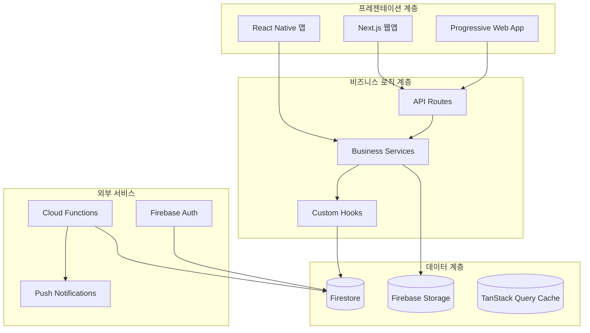

# 🏗️ 아키텍처 문서 (Architecture Documentation)

*DogNote 프로젝트의 시스템 아키텍처, 데이터베이스 설계, 마이그레이션 계획을 다룹니다.*

---

## 📁 문서 목록

### 🎯 핵심 아키텍처 문서
| 문서명 | 상태 | 설명 | 최종 업데이트 |
|--------|------|------|---------------|
| [시스템 아키텍처](./system-architecture.md) | ✅ 완료 | 전체 시스템 구조, 컴포넌트 관계, 데이터 플로우 | 2025-08-31 |
| [데이터베이스 설계](./database-design.md) | ✅ 완료 | Firestore 스키마, 인덱스 전략, 보안 규칙 | 2025-08-31 |
| [마이그레이션 계획](./migration-guide.md) | ✅ 완료 | 단계별 DB 마이그레이션, 스크립트, 롤백 계획 | 2025-08-31 |

### 📊 상세 설계 문서
| 문서명 | 상태 | 설명 | 최종 업데이트 |
|--------|------|------|---------------|
| [API 아키텍처](./api-architecture.md) | 🔄 진행중 | RESTful API, GraphQL, 서버리스 함수 설계 | - |
| [보안 아키텍처](./security-architecture.md) | 📋 계획됨 | 인증/인가, 데이터 보호, 보안 정책 | - |
| [성능 아키텍처](./performance-architecture.md) | 📋 계획됨 | 캐싱 전략, 최적화, 스케일링 | - |

---

## 🎯 아키텍처 개요

### 시스템 구조

### 핵심 설계 원칙

#### 1. **클린 아키텍처 (Clean Architecture)**
- 의존성 역전: 외부 의존성으로부터 비즈니스 로직 분리
- 계층 분리: UI → 비즈니스 → 데이터 계층 명확한 분리
- 테스트 가능성: 모든 계층에서 단위 테스트 지원

#### 2. **확장성 우선 (Scalability First)**
- 수평 확장: Firebase 서버리스 아키텍처
- 마이크로서비스 준비: 도메인별 서비스 분리 구조
- 캐싱 전략: 다중 레벨 캐싱으로 성능 최적화

#### 3. **보안 중심 (Security by Design)**
- 데이터 격리: 사용자별 완전 격리된 데이터 구조
- 최소 권한 원칙: Firestore 보안 규칙로 세밀한 접근 제어
- 암호화: 전송/저장 시 데이터 암호화

---

## 📊 아키텍처 현황

### ✅ 완료된 설계
- [x] **시스템 전체 구조** - 계층별 역할 정의
- [x] **데이터베이스 스키마** - Firestore 컬렉션/문서 구조
- [x] **보안 규칙** - 사용자 데이터 격리 및 권한 관리
- [x] **인덱싱 전략** - 쿼리 성능 최적화
- [x] **마이그레이션 계획** - 단계별 DB 개선 방안

### 🔄 진행 중인 설계
- [ ] **API 표준화** - RESTful API 가이드라인 정립
- [ ] **성능 최적화** - 캐싱 및 번들 최적화 전략
- [ ] **모니터링 아키텍처** - 로깅, 메트릭, 알림 체계

### 📋 향후 계획
- [ ] **마이크로서비스 전환** - 도메인별 서비스 분리
- [ ] **다중 리전 지원** - 글로벌 서비스 준비
- [ ] **하이브리드 클라우드** - 멀티 클라우드 전략

---

## 🔧 개발자 가이드

### 아키텍처 변경 프로세스
1. **RFC (Request for Comments)** 작성
2. **아키텍처 리뷰** 진행 (Tech Lead 승인 필요)
3. **영향도 분석** 및 마이그레이션 계획 수립
4. **단계적 구현** 및 테스트
5. **문서 업데이트** 및 팀 공유

### 설계 결정 기록 (ADR)
주요 아키텍처 결정사항은 `docs/02-architecture/decisions/` 폴더에 ADR 형태로 기록됩니다.

### 참고 리소스
- [Firebase 아키텍처 베스트 프랙티스](https://firebase.google.com/docs/firestore/solutions)
- [Next.js 아키텍처 가이드](https://nextjs.org/docs/architecture)
- [클린 아키텍처 원칙](https://blog.cleancoder.com/uncle-bob/2012/08/13/the-clean-architecture.html)

---

## 📞 문의 및 지원

아키텍처 관련 문의사항이나 제안사항이 있으시면:
- **Tech Lead**: 시스템 아키텍처 전반
- **Database Team**: 데이터 모델링 및 성능
- **DevOps Team**: 인프라 및 배포 아키텍처

---

*본 문서는 프로젝트 진행에 따라 지속적으로 업데이트됩니다.*

**문서 히스토리:**
- 2025-08-31: GlobalRules 표준 적용, 구조 개편
