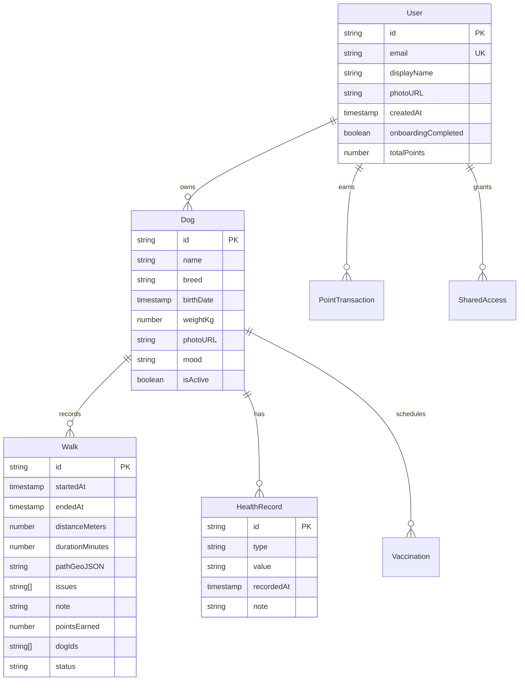

# 🗄️ 데이터베이스 설계 (Database Design)

*버전: 2.0*  
*최종 업데이트: 2025-08-31*  
*승인자: Tech Lead, Database Architect*

---

## 📖 목차

1. [개요](#개요)
2. [설계 원칙](#설계-원칙)
3. [현재 문제점 분석](#현재-문제점-분석)
4. [개선된 데이터 모델](#개선된-데이터-모델)
5. [Firestore 스키마](#firestore-스키마)
6. [인덱싱 전략](#인덱싱-전략)
7. [보안 규칙](#보안-규칙)
8. [성능 최적화](#성능-최적화)
9. [마이그레이션 계획](#마이그레이션-계획)

---

## 1. 개요

### 1.1 문서 목적
DogNote 프로젝트의 데이터베이스 설계를 정의하며, 확장성, 유지보수성, 그리고 다른 데이터베이스로의 이식성을 고려하여 작성되었습니다.

### 1.2 데이터베이스 선택
- **Primary DB**: Firebase Firestore (NoSQL 문서 데이터베이스)
- **캐싱**: TanStack Query (클라이언트 사이드)
- **파일 저장소**: Firebase Storage
- **실시간 동기화**: Firestore 실시간 리스너

---

## 2. 설계 원칙

### 2.1 확장성 (Scalability)
- **수평적 확장**: Firestore의 자동 샤딩 활용
- **쿼리 최적화**: 복합 인덱스로 성능 보장
- **데이터 분산**: 사용자별 서브컬렉션 구조

### 2.2 유지보수성 (Maintainability)  
- **명확한 스키마**: TypeScript 인터페이스로 타입 정의
- **일관된 네이밍**: camelCase 필드명, 복수형 컬렉션명
- **버전 관리**: 스키마 변경 시 하위 호환성 보장

### 2.3 보안성 (Security)
- **데이터 격리**: 사용자별 완전 분리된 데이터 구조
- **최소 권한**: 세밀한 Firestore 보안 규칙
- **감사 추적**: 모든 변경사항 타임스탬프 기록

---

## 3. 현재 문제점 분석

### 3.1 데이터 정합성 문제 ❌
```typescript
// 문제가 있는 기존 구조
interface User {
  dogs: string[];  // 양방향 참조 문제
}

interface Dog {
  userId: string;  // 동기화 이슈 발생 가능
}
```

### 3.2 스키마 불일치 ❌
- Firebase Timestamp와 ISO 문자열 혼재
- 선택적 필드의 일관성 부족  
- Read/Write 타입 분리 부족

### 3.3 확장성 제약 ❌
- NoSQL 특성을 제대로 활용하지 못한 설계
- 복합 쿼리를 위한 인덱스 설계 부족
- 데이터 중복 vs 쿼리 성능 간 균형 부족

---

## 4. 개선된 데이터 모델

### 4.1 핵심 엔티티 관계



### 4.2 타입 정의

```typescript
// 기본 타입 정의
type Timestamp = FirebaseFirestore.Timestamp;
type GeoPoint = FirebaseFirestore.GeoPoint;

// 사용자 관련 타입
interface User {
  id: string;
  email: string;
  displayName: string;
  photoURL?: string;
  createdAt: Timestamp;
  updatedAt: Timestamp;
  lastActiveAt: Timestamp;
  onboardingCompleted: boolean;
  totalPoints: number;
  preferences: UserPreferences;
}

interface UserPreferences {
  language: 'ko' | 'en';
  notifications: {
    walk: boolean;
    health: boolean;
    vaccination: boolean;
  };
  privacy: {
    shareWalkData: boolean;
    allowDataAnalysis: boolean;
  };
}

// 반려견 관련 타입
interface Dog {
  id: string;
  name: string;
  breed: string;
  birthDate: Timestamp;
  weightKg: number;
  gender: 'male' | 'female';
  photoURL?: string;
  mood: 'happy' | 'normal' | 'sad' | 'sick';
  isActive: boolean;
  createdAt: Timestamp;
  updatedAt: Timestamp;
  medicalInfo?: {
    allergies: string[];
    medications: string[];
    specialNeeds: string;
  };
}

// 산책 관련 타입
interface Walk {
  id: string;
  startedAt: Timestamp;
  endedAt?: Timestamp;
  distanceMeters: number;
  durationMinutes: number;
  averageSpeed: number;
  pathGeoJSON?: GeoJSON.LineString;
  startLocation?: GeoPoint;
  endLocation?: GeoPoint;
  weather?: WeatherData;
  issues: WalkIssue[];
  note?: string;
  photos?: string[];
  pointsEarned: number;
  status: 'draft' | 'active' | 'completed' | 'cancelled';
  dogIds: string[];
  createdAt: Timestamp;
  updatedAt: Timestamp;
}

interface WalkIssue {
  type: 'health' | 'behavior' | 'environment' | 'other';
  severity: 'low' | 'medium' | 'high';
  description: string;
  timestamp: Timestamp;
}

interface WeatherData {
  temperature: number;
  humidity: number;
  condition: 'sunny' | 'cloudy' | 'rainy' | 'snowy';
  windSpeed: number;
}

// 건강 관리 타입
interface HealthRecord {
  id: string;
  type: 'weight' | 'medication' | 'symptom' | 'visit' | 'other';
  value: string | number;
  unit?: string;
  recordedAt: Timestamp;
  note?: string;
  attachments?: string[];
  createdBy: string;
  createdAt: Timestamp;
}

interface Vaccination {
  id: string;
  vaccineName: string;
  dueDate: Timestamp;
  completedAt?: Timestamp;
  clinicName?: string;
  batchNumber?: string;
  nextDueDate?: Timestamp;
  done: boolean;
  reminder: boolean;
  note?: string;
  createdAt: Timestamp;
  updatedAt: Timestamp;
}

// 포인트 시스템 타입
interface PointTransaction {
  id: string;
  type: 'earn' | 'spend' | 'bonus' | 'penalty';
  amount: number;
  source: 'walk' | 'achievement' | 'bonus' | 'admin';
  description: string;
  relatedId?: string; // walkId, achievementId 등
  createdAt: Timestamp;
  expiredAt?: Timestamp;
}
```

---

## 5. Firestore 스키마

### 5.1 컬렉션 구조

```
📁 users/                           # 사용자 컬렉션
├── {userId}/                       # 사용자 문서
│   ├── dogs/                       # 반려견 서브컬렉션
│   │   └── {dogId}/                # 반려견 문서
│   │       ├── walks/              # 산책 기록
│   │       ├── healthRecords/      # 건강 기록
│   │       └── vaccinations/       # 예방접종 기록
│   ├── pointTransactions/          # 포인트 거래 내역
│   └── sharedAccess/               # 공유 접근 권한
```

### 5.2 문서 경로 예시

```typescript
// Firestore 경로 정의
const COLLECTIONS = {
  USERS: 'users',
  DOGS: (userId: string) => `users/${userId}/dogs`,
  WALKS: (userId: string, dogId: string) => `users/${userId}/dogs/${dogId}/walks`,
  HEALTH_RECORDS: (userId: string, dogId: string) => `users/${userId}/dogs/${dogId}/healthRecords`,
  VACCINATIONS: (userId: string, dogId: string) => `users/${userId}/dogs/${dogId}/vaccinations`,
  POINTS: (userId: string) => `users/${userId}/pointTransactions`,
  SHARED_ACCESS: (userId: string) => `users/${userId}/sharedAccess`,
} as const;

// 타입 안전한 문서 참조
const getUserDoc = (userId: string) => 
  firestore().collection(COLLECTIONS.USERS).doc(userId);

const getDogsCollection = (userId: string) =>
  firestore().collection(COLLECTIONS.DOGS(userId));

const getWalksCollection = (userId: string, dogId: string) =>
  firestore().collection(COLLECTIONS.WALKS(userId, dogId));
```

---

## 6. 인덱싱 전략

### 6.1 복합 인덱스 정의

```json
{
  "indexes": [
    {
      "collectionGroup": "walks",
      "queryScope": "COLLECTION",
      "fields": [
        {"fieldPath": "status", "order": "ASCENDING"},
        {"fieldPath": "startedAt", "order": "DESCENDING"}
      ]
    },
    {
      "collectionGroup": "walks",
      "queryScope": "COLLECTION", 
      "fields": [
        {"fieldPath": "dogIds", "arrayConfig": "CONTAINS"},
        {"fieldPath": "startedAt", "order": "DESCENDING"}
      ]
    },
    {
      "collectionGroup": "healthRecords",
      "queryScope": "COLLECTION",
      "fields": [
        {"fieldPath": "type", "order": "ASCENDING"},
        {"fieldPath": "recordedAt", "order": "DESCENDING"}
      ]
    },
    {
      "collectionGroup": "vaccinations",
      "queryScope": "COLLECTION",
      "fields": [
        {"fieldPath": "done", "order": "ASCENDING"},
        {"fieldPath": "dueDate", "order": "ASCENDING"}
      ]
    }
  ],
  "fieldOverrides": [
    {
      "collectionGroup": "walks",
      "fieldPath": "pathGeoJSON",
      "indexes": []
    },
    {
      "collectionGroup": "healthRecords", 
      "fieldPath": "attachments",
      "ttl": false,
      "indexes": [
        {"order": "ASCENDING", "queryScope": "COLLECTION"}
      ]
    }
  ]
}
```

### 6.2 쿼리 최적화 예시

```typescript
// 최적화된 쿼리 예시
export class WalkRepository {
  // 특정 기간 산책 조회 (인덱스 활용)
  async getWalksByDateRange(
    userId: string, 
    dogId: string, 
    startDate: Date, 
    endDate: Date
  ) {
    return await firestore()
      .collection(COLLECTIONS.WALKS(userId, dogId))
      .where('status', '==', 'completed')
      .where('startedAt', '>=', Timestamp.fromDate(startDate))
      .where('startedAt', '<=', Timestamp.fromDate(endDate))
      .orderBy('startedAt', 'desc')
      .limit(50)
      .get();
  }

  // 다중 반려견 산책 조회 (배열 인덱스 활용)
  async getWalksByMultipleDogs(userId: string, dogIds: string[]) {
    const queries = dogIds.map(dogId =>
      firestore()
        .collection(COLLECTIONS.WALKS(userId, dogId))
        .where('dogIds', 'array-contains', dogId)
        .orderBy('startedAt', 'desc')
        .limit(10)
        .get()
    );
    
    const results = await Promise.all(queries);
    return results.flatMap(result => result.docs);
  }
}
```

---

## 7. 보안 규칙

### 7.1 Firestore 보안 규칙

```javascript
rules_version = '2';
service cloud.firestore {
  match /databases/{database}/documents {
    // 유틸리티 함수
    function isAuthenticated() {
      return request.auth != null;
    }
    
    function isOwner(userId) {
      return isAuthenticated() && request.auth.uid == userId;
    }
    
    function isValidUserData(data) {
      return data.keys().hasAll(['email', 'displayName', 'createdAt']) &&
             data.email is string &&
             data.displayName is string &&
             data.createdAt is timestamp;
    }
    
    function isValidDogData(data) {
      return data.keys().hasAll(['name', 'breed', 'birthDate']) &&
             data.name is string &&
             data.breed is string &&
             data.birthDate is timestamp &&
             data.weightKg is number &&
             data.weightKg > 0 &&
             data.weightKg < 200;
    }
    
    // 사용자 컬렉션
    match /users/{userId} {
      allow read, write: if isOwner(userId) && 
                           (request.method != 'create' || isValidUserData(request.resource.data));
      
      // 반려견 서브컬렉션
      match /dogs/{dogId} {
        allow read, write: if isOwner(userId) &&
                             (request.method != 'create' || isValidDogData(request.resource.data));
        
        // 산책 기록 서브컬렉션
        match /walks/{walkId} {
          allow read, write: if isOwner(userId);
          // 특별 규칙: draft 상태의 산책은 2시간 후 자동 삭제
          allow delete: if isOwner(userId) || 
                           (resource.data.status == 'draft' && 
                            resource.data.createdAt < timestamp.date() - duration.hours(2));
        }
        
        // 건강 기록 서브컬렉션
        match /healthRecords/{recordId} {
          allow read, write: if isOwner(userId);
        }
        
        // 예방접종 서브컬렉션
        match /vaccinations/{vaccId} {
          allow read, write: if isOwner(userId);
        }
      }
      
      // 포인트 거래 내역 (읽기 전용, Cloud Function만 수정 가능)
      match /pointTransactions/{transactionId} {
        allow read: if isOwner(userId);
        allow write: if false; // Cloud Function만 접근 가능
      }
      
      // 공유 접근 권한
      match /sharedAccess/{accessId} {
        allow read: if isOwner(userId) || 
                       request.auth.uid in resource.data.authorizedUsers;
        allow write: if isOwner(userId);
      }
    }
    
    // 관리자 전용 컬렉션
    match /admin/{document=**} {
      allow read, write: if isAuthenticated() && 
                           request.auth.token.admin == true;
    }
    
    // 글로벌 설정 (읽기 전용)
    match /config/{configId} {
      allow read: if isAuthenticated();
      allow write: if false;
    }
  }
}
```

### 7.2 Storage 보안 규칙

```javascript
rules_version = '2';
service firebase.storage {
  match /b/{bucket}/o {
    // 사용자별 파일 저장소
    match /users/{userId}/dogs/{dogId}/{fileName} {
      allow read, write: if request.auth != null && 
                           request.auth.uid == userId &&
                           fileName.matches('.*\\.(jpg|jpeg|png|webp)$') &&
                           request.resource.size < 5 * 1024 * 1024; // 5MB 제한
    }
    
    // 사용자 프로필 이미지
    match /users/{userId}/profile/{fileName} {
      allow read, write: if request.auth != null && 
                           request.auth.uid == userId &&
                           fileName.matches('.*\\.(jpg|jpeg|png|webp)$') &&
                           request.resource.size < 2 * 1024 * 1024; // 2MB 제한
    }
  }
}
```

---

## 8. 성능 최적화

### 8.1 쿼리 최적화 전략

```typescript
// 배치 읽기 최적화
export class BatchQueryOptimizer {
  async getDogsSummary(userId: string): Promise<DogSummary[]> {
    const dogsSnapshot = await firestore()
      .collection(COLLECTIONS.DOGS(userId))
      .where('isActive', '==', true)
      .get();
    
    const dogIds = dogsSnapshot.docs.map(doc => doc.id);
    
    // 병렬로 최근 산책 데이터 조회
    const recentWalksPromises = dogIds.map(dogId =>
      firestore()
        .collection(COLLECTIONS.WALKS(userId, dogId))
        .where('status', '==', 'completed')
        .orderBy('startedAt', 'desc')
        .limit(1)
        .get()
    );
    
    const recentWalksResults = await Promise.all(recentWalksPromises);
    
    return dogsSnapshot.docs.map((dogDoc, index) => ({
      id: dogDoc.id,
      ...dogDoc.data() as Dog,
      lastWalk: recentWalksResults[index].docs[0]?.data() as Walk | undefined,
    }));
  }
}

// 캐싱 전략
export class CachedRepository<T> {
  private cache = new Map<string, { data: T; timestamp: number }>();
  private TTL = 5 * 60 * 1000; // 5분
  
  async get(key: string, fetcher: () => Promise<T>): Promise<T> {
    const cached = this.cache.get(key);
    
    if (cached && Date.now() - cached.timestamp < this.TTL) {
      return cached.data;
    }
    
    const data = await fetcher();
    this.cache.set(key, { data, timestamp: Date.now() });
    return data;
  }
  
  invalidate(key: string) {
    this.cache.delete(key);
  }
  
  invalidatePattern(pattern: RegExp) {
    for (const key of this.cache.keys()) {
      if (pattern.test(key)) {
        this.cache.delete(key);
      }
    }
  }
}
```

### 8.2 데이터 중복화 전략

```typescript
// 성능을 위한 선택적 데이터 중복화
interface WalkWithDogInfo extends Walk {
  dogInfo: {
    name: string;
    breed: string;
    photoURL?: string;
  }[];
}

// 산책 저장 시 반려견 기본 정보도 함께 저장
export const saveWalkWithDogInfo = async (
  userId: string,
  walkData: Omit<Walk, 'id' | 'createdAt' | 'updatedAt'>,
  dogs: Dog[]
) => {
  const walkDoc = firestore()
    .collection(COLLECTIONS.WALKS(userId, walkData.dogIds[0]))
    .doc();
  
  const walkWithDogInfo: WalkWithDogInfo = {
    ...walkData,
    id: walkDoc.id,
    createdAt: Timestamp.now(),
    updatedAt: Timestamp.now(),
    dogInfo: dogs.map(dog => ({
      name: dog.name,
      breed: dog.breed,
      photoURL: dog.photoURL,
    })),
  };
  
  await walkDoc.set(walkWithDogInfo);
  return walkWithDogInfo;
};
```

---

## 9. 마이그레이션 계획

### 9.1 단계별 마이그레이션

#### Phase 1: 스키마 정규화 (4주)
- [ ] 기존 데이터 백업 및 분석
- [ ] 새로운 타입 정의 적용
- [ ] 점진적 필드 추가/수정
- [ ] 하위 호환성 유지

#### Phase 2: 성능 최적화 (2주)  
- [ ] 복합 인덱스 추가
- [ ] 불필요한 필드 제거
- [ ] 쿼리 최적화
- [ ] 캐싱 계층 추가

#### Phase 3: 고급 기능 (4주)
- [ ] 다중 반려견 동시 산책 지원
- [ ] 공유 접근 권한 시스템
- [ ] 고급 분석 데이터 구조
- [ ] 외부 API 연동 준비

### 9.2 마이그레이션 스크립트 예시

```typescript
// 마이그레이션 유틸리티
export class DatabaseMigrator {
  async migrateUserSchema(userId: string) {
    const userDoc = await firestore()
      .collection('users')
      .doc(userId)
      .get();
    
    if (!userDoc.exists) return;
    
    const userData = userDoc.data();
    const updates: Partial<User> = {};
    
    // 신규 필드 추가
    if (!userData?.preferences) {
      updates.preferences = {
        language: 'ko',
        notifications: {
          walk: true,
          health: true,
          vaccination: true,
        },
        privacy: {
          shareWalkData: false,
          allowDataAnalysis: true,
        },
      };
    }
    
    // 타입 변환
    if (userData?.totalPoints && typeof userData.totalPoints === 'string') {
      updates.totalPoints = parseInt(userData.totalPoints, 10) || 0;
    }
    
    if (Object.keys(updates).length > 0) {
      updates.updatedAt = Timestamp.now();
      await userDoc.ref.update(updates);
    }
  }
  
  async migrateAllUsers() {
    const usersSnapshot = await firestore()
      .collection('users')
      .get();
    
    const migrationPromises = usersSnapshot.docs.map(doc =>
      this.migrateUserSchema(doc.id)
    );
    
    await Promise.all(migrationPromises);
  }
}
```

---

## 📎 참고 자료

### A. Firestore 베스트 프랙티스
- [Firestore 데이터 모델링 가이드](https://firebase.google.com/docs/firestore/manage-data/structure-data)
- [Firestore 보안 규칙 가이드](https://firebase.google.com/docs/firestore/security/get-started)
- [Firestore 인덱싱 전략](https://firebase.google.com/docs/firestore/query-data/indexing)

### B. 관련 문서
- [시스템 아키텍처](./system-architecture.md)
- [마이그레이션 가이드](./migration-guide.md)
- [API 문서](../04-development/api-documentation.md)

---

*본 문서는 데이터베이스 스키마 변경 시 업데이트되며, 모든 변경사항은 마이그레이션 계획을 통해 관리됩니다.*

**문서 히스토리:**
- v1.0: 2025-08-03 (초기 데이터베이스 설계)
- v2.0: 2025-08-31 (GlobalRules 표준 적용, 보안 강화, 성능 최적화)
