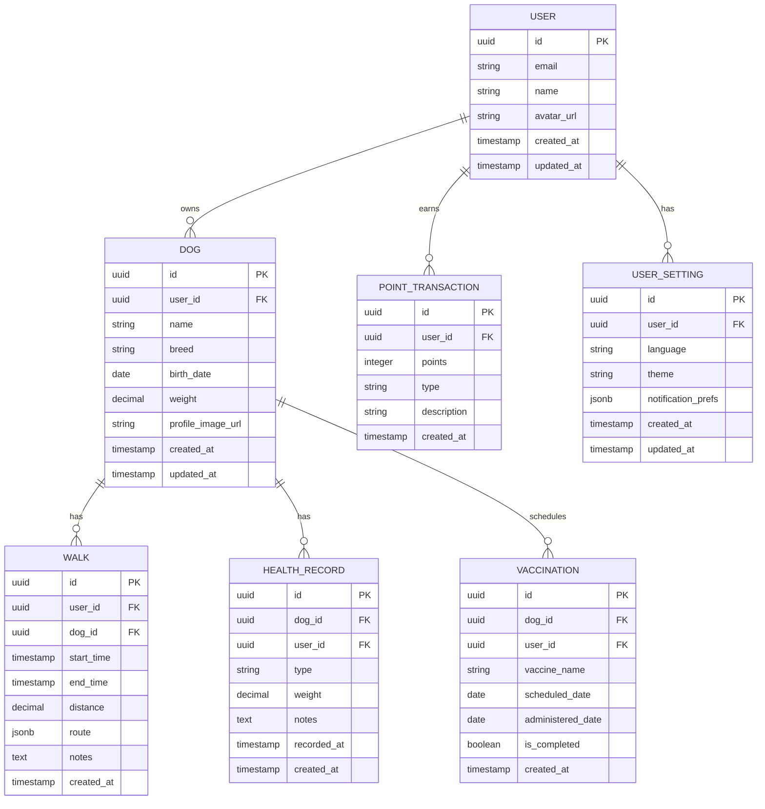

# 🗄️ 데이터베이스 설계 (Database Design)

_버전: 3.0_  
_최종 업데이트: 2025-04-05_  
_데이터베이스: Supabase PostgreSQL_

---

## 📖 목차

1. [개요](#개요)
2. [설계 원칙](#설계-원칙)
3. [스키마 설계](#스키마-설계)
4. [테이블 정의](#테이블-정의)
5. [RLS (Row Level Security)](#rls-row-level-security)
6. [인덱스 전략](#인덱스-전략)
7. [관계형 모델](#관계형-모델)

---

## 1. 개요

### 1.1 데이터베이스 선택

- **Primary DB**: Supabase PostgreSQL (관계형 데이터베이스)
- **Authentication**: Supabase Auth
- **파일 저장소**: Supabase Storage
- **캐싱**: TanStack Query (클라이언트 사이드)

### 1.2 마이그레이션 이력

- **v3.0**: Firebase Firestore → Supabase PostgreSQL 마이그레이션 완료
- **v2.0**: Firestore 스키마 개선
- **v1.0**: 초기 Firestore 설계

---

## 2. 설계 원칙

### 2.1 정규화

- 3NF (제3정규형) 준수
- 데이터 중복 최소화
- 참조 무결성 보장 (Foreign Key)

### 2.2 보안

- Row Level Security (RLS) 적용
- 사용자별 데이터 격리
- 세밀한 접근 제어

### 2.3 확장성

- 인덱스 기반 쿼리 최적화
- JSONB 필드로 유연한 스키마 지원
- 파티셔닝 전략 수립

---

## 3. 스키마 설계

### 3.1 ERD



---

## 4. 테이블 정의

### 4.1 users (Supabase Auth 연동)

```sql
-- Supabase Auth와 자동 연동되는 users 테이블
-- 별도 생성 불필요, auth.users 사용
```

### 4.2 dogs

```sql
create table dogs (
  id uuid default gen_random_uuid() primary key,
  user_id uuid references auth.users(id) not null,
  name text not null,
  breed text,
  birth_date date,
  weight numeric(5,2),
  profile_image_url text,
  created_at timestamp with time zone default timezone('utc'::text, now()) not null,
  updated_at timestamp with time zone default timezone('utc'::text, now()) not null
);

-- 인덱스
create index idx_dogs_user_id on dogs(user_id);
create index idx_dogs_created_at on dogs(created_at);
```

### 4.3 walks

```sql
create table walks (
  id uuid default gen_random_uuid() primary key,
  user_id uuid references auth.users(id) not null,
  dog_id uuid references dogs(id) not null,
  start_time timestamp with time zone not null,
  end_time timestamp with time zone,
  distance numeric(10,2),
  route jsonb,
  notes text,
  created_at timestamp with time zone default timezone('utc'::text, now()) not null
);

-- 인덱스
create index idx_walks_user_id on walks(user_id);
create index idx_walks_dog_id on walks(dog_id);
create index idx_walks_start_time on walks(start_time);
```

### 4.4 health_records

```sql
create table health_records (
  id uuid default gen_random_uuid() primary key,
  user_id uuid references auth.users(id) not null,
  dog_id uuid references dogs(id) not null,
  type text not null, -- 'weight', 'medication', 'checkup', etc.
  weight numeric(5,2),
  notes text,
  recorded_at timestamp with time zone not null,
  created_at timestamp with time zone default timezone('utc'::text, now()) not null
);

-- 인덱스
create index idx_health_records_dog_id on health_records(dog_id);
create index idx_health_records_recorded_at on health_records(recorded_at);
```

### 4.5 vaccinations

```sql
create table vaccinations (
  id uuid default gen_random_uuid() primary key,
  user_id uuid references auth.users(id) not null,
  dog_id uuid references dogs(id) not null,
  vaccine_name text not null,
  scheduled_date date not null,
  administered_date date,
  is_completed boolean default false,
  created_at timestamp with time zone default timezone('utc'::text, now()) not null
);

-- 인덱스
create index idx_vaccinations_dog_id on vaccinations(dog_id);
create index idx_vaccinations_scheduled_date on vaccinations(scheduled_date);
create index idx_vaccinations_is_completed on vaccinations(is_completed) where is_completed = false;
```

### 4.6 point_transactions

```sql
create table point_transactions (
  id uuid default gen_random_uuid() primary key,
  user_id uuid references auth.users(id) not null,
  points integer not null,
  type text not null, -- 'walk', 'bonus', 'purchase', etc.
  description text,
  reference_id uuid, -- walks.id 등 참조
  created_at timestamp with time zone default timezone('utc'::text, now()) not null
);

-- 인덱스
create index idx_point_transactions_user_id on point_transactions(user_id);
create index idx_point_transactions_created_at on point_transactions(created_at);
```

### 4.7 user_settings

```sql
create table user_settings (
  id uuid default gen_random_uuid() primary key,
  user_id uuid references auth.users(id) not null unique,
  language text default 'ko',
  theme text default 'light',
  notification_prefs jsonb default '{}',
  created_at timestamp with time zone default timezone('utc'::text, now()) not null,
  updated_at timestamp with time zone default timezone('utc'::text, now()) not null
);

-- 인덱스
create index idx_user_settings_user_id on user_settings(user_id);
```

---

## 5. RLS (Row Level Security)

### 5.1 활성화

```sql
alter table dogs enable row level security;
alter table walks enable row level security;
alter table health_records enable row level security;
alter table vaccinations enable row level security;
alter table point_transactions enable row level security;
alter table user_settings enable row level security;
```

### 5.2 정책 설정

```sql
-- dogs 테이블 RLS
CREATE POLICY "Users can only access their own dogs"
  ON dogs FOR ALL
  USING (auth.uid() = user_id);

-- walks 테이블 RLS
CREATE POLICY "Users can only access their own walks"
  ON walks FOR ALL
  USING (auth.uid() = user_id);

-- health_records 테이블 RLS
CREATE POLICY "Users can only access their own health records"
  ON health_records FOR ALL
  USING (auth.uid() = user_id);

-- vaccinations 테이블 RLS
CREATE POLICY "Users can only access their own vaccinations"
  ON vaccinations FOR ALL
  USING (auth.uid() = user_id);

-- point_transactions 테이블 RLS
CREATE POLICY "Users can only access their own points"
  ON point_transactions FOR ALL
  USING (auth.uid() = user_id);

-- user_settings 테이블 RLS
CREATE POLICY "Users can only access their own settings"
  ON user_settings FOR ALL
  USING (auth.uid() = user_id);
```

---

## 6. 인덱스 전략

### 6.1 필수 인덱스

| 테이블             | 인덱스명                  | 컬럼                     | 용도                 |
| ------------------ | ------------------------- | ------------------------ | -------------------- |
| dogs               | idx_dogs_user_id          | user_id                  | 사용자별 반려견 조회 |
| walks              | idx_walks_user_id_dog_id  | (user_id, dog_id)        | 산책 기록 필터링     |
| walks              | idx_walks_start_time      | start_time               | 날짜별 정렬          |
| vaccinations       | idx_vaccinations_upcoming | (dog_id, scheduled_date) | 예정된 접종 조회     |
| point_transactions | idx_points_user_created   | (user_id, created_at)    | 포인트 히스토리      |

### 6.2 복합 인덱스

```sql
-- 산책 통계 조회용 복합 인덱스
create index idx_walks_user_date on walks(user_id, start_time desc);

-- 건강 기록 조회용
create index idx_health_dog_type on health_records(dog_id, type, recorded_at desc);
```

---

## 7. 관계형 모델

### 7.1 참조 무결성

- 모든 테이블은 `user_id`로 auth.users 참조
- walks, health_records, vaccinations는 dog_id로 dogs 참조
- ON DELETE CASCADE 적용 고려 (설정별 결정)

### 7.2 트리거 (자동 업데이트)

```sql
-- updated_at 자동 갱신 트리거
CREATE OR REPLACE FUNCTION update_updated_at_column()
RETURNS TRIGGER AS $$
BEGIN
  NEW.updated_at = timezone('utc'::text, now());
  RETURN NEW;
END;
$$ language 'plpgsql';

CREATE TRIGGER update_dogs_updated_at
  BEFORE UPDATE ON dogs
  FOR EACH ROW EXECUTE FUNCTION update_updated_at_column();

CREATE TRIGGER update_user_settings_updated_at
  BEFORE UPDATE ON user_settings
  FOR EACH ROW EXECUTE FUNCTION update_updated_at_column();
```

---

**문서 히스토리:**

- v3.0: 2025-04-05 - Supabase PostgreSQL 마이그레이션 완료
- v2.0: 2025-08-31 - Firestore 스키마 개선
- v1.0: 2025-01-16 - 초기 설계
