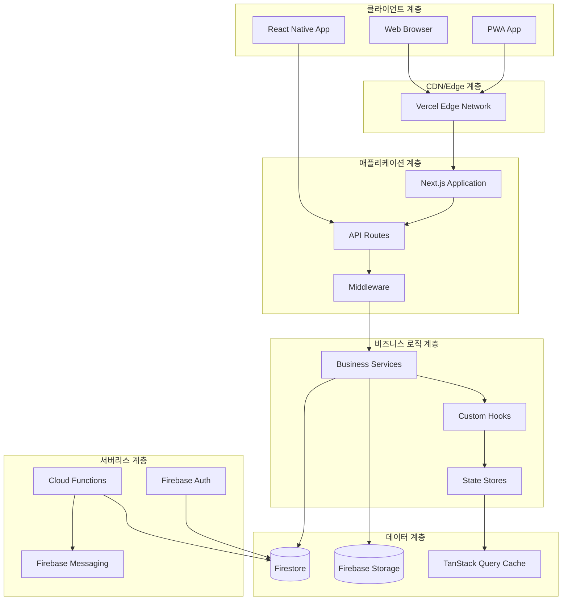
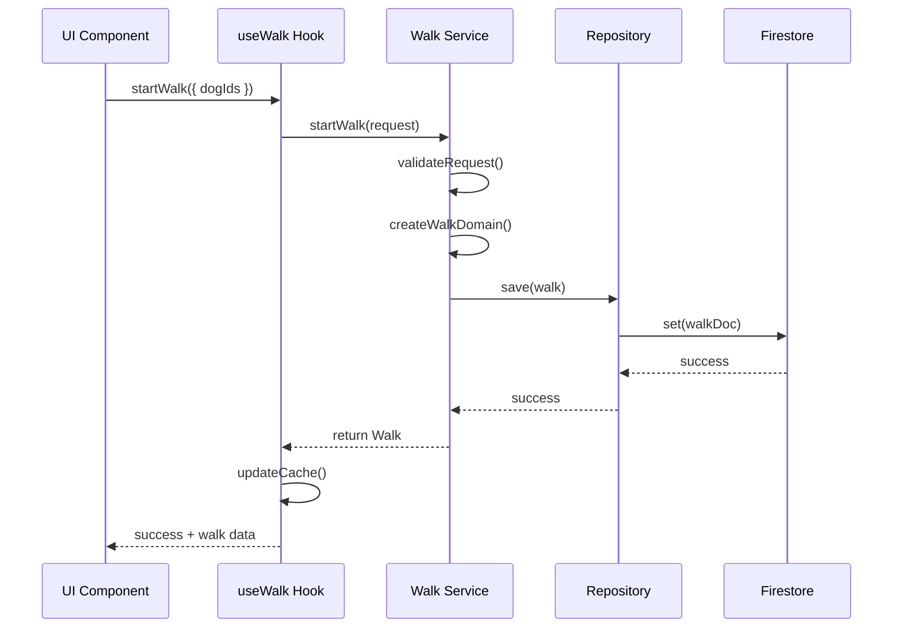
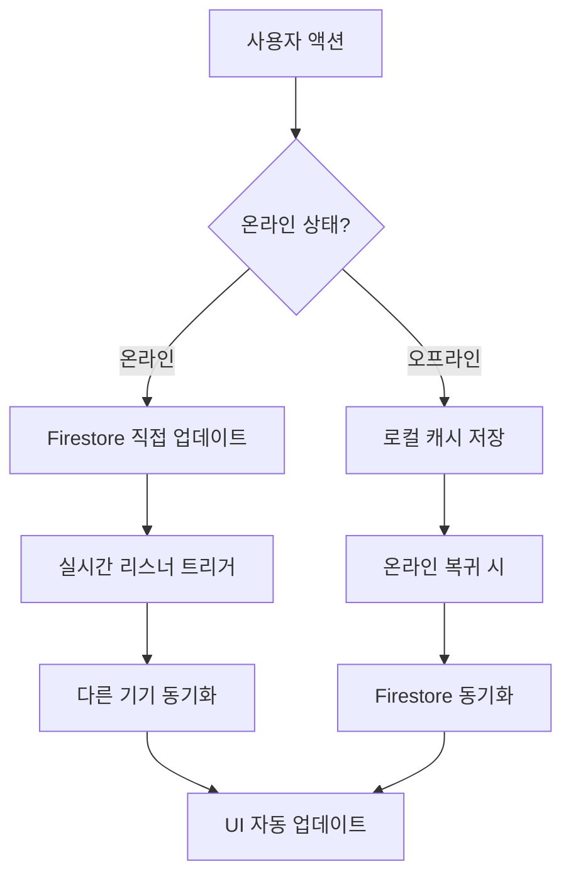
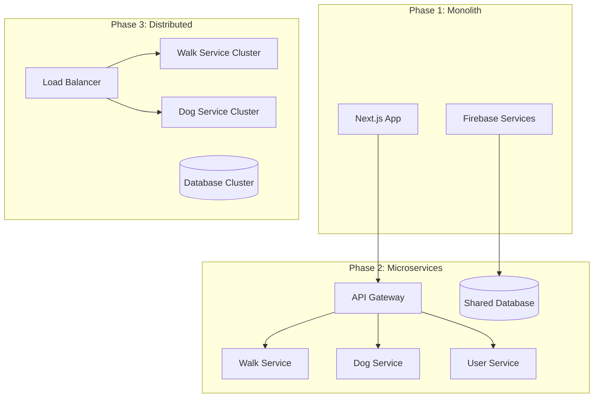
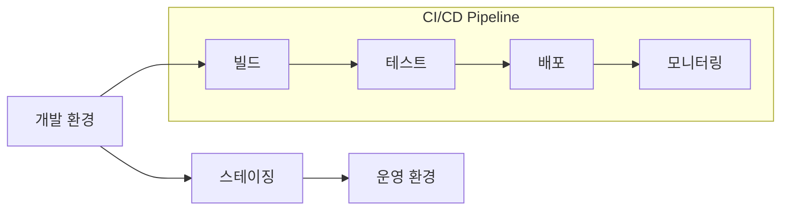

# 🏛️ 시스템 아키텍처 (System Architecture)

*버전: 2.0*  
*최종 업데이트: 2025-08-31*  
*승인자: Tech Lead, Solution Architect*

---

## 📖 목차

1. [개요](#개요)
2. [아키텍처 원칙](#아키텍처-원칙)
3. [시스템 전체 구조](#시스템-전체-구조)
4. [계층별 상세 설계](#계층별-상세-설계)
5. [데이터 플로우](#데이터-플로우)
6. [확장성 설계](#확장성-설계)
7. [배포 아키텍처](#배포-아키텍처)

---

## 1. 개요

### 1.1 시스템 개요
DogNote는 **서버리스 우선(Serverless-First)** 아키텍처를 채택하여 빠른 개발과 자동 확장을 추구합니다. Firebase BaaS를 중심으로 한 모던 JAMstack 구조로 설계되었습니다.

### 1.2 아키텍처 목표
- **빠른 개발**: Firebase BaaS로 백엔드 개발 시간 단축
- **자동 확장**: 서버리스 인프라의 탄력적 확장  
- **고가용성**: 99.9% 이상의 서비스 가용성
- **글로벌 배포**: CDN과 Edge 컴퓨팅 활용

---

## 2. 아키텍처 원칙

### 2.1 설계 원칙

#### 🎯 **단일 책임 원칙 (Single Responsibility)**
```typescript
// ✅ 좋은 예: 각 서비스가 단일 책임을 가짐
class WalkService {
  async startWalk(userId: string, dogIds: string[]) { /* ... */ }
  async endWalk(walkId: string, walkData: WalkEndData) { /* ... */ }
}

class PointService {
  async calculateWalkPoints(distance: number) { /* ... */ }
  async updateUserPoints(userId: string, points: number) { /* ... */ }
}
```

#### 🔄 **의존성 역전 원칙 (Dependency Inversion)**
```typescript
// ✅ 추상화에 의존하는 구조
interface WalkRepository {
  save(walk: Walk): Promise<void>;
  findByUser(userId: string): Promise<Walk[]>;
}

class WalkService {
  constructor(private walkRepo: WalkRepository) {}
}

// 구현체는 런타임에 주입
const walkService = new WalkService(new FirestoreWalkRepository());
```

#### 🏗️ **계층 분리 (Layered Architecture)**
```
┌─────────────────────────────────────┐
│         Presentation Layer          │ ← UI Components, Pages
├─────────────────────────────────────┤
│         Application Layer           │ ← Custom Hooks, State Management
├─────────────────────────────────────┤
│          Domain Layer               │ ← Business Logic, Services
├─────────────────────────────────────┤
│        Infrastructure Layer         │ ← Firebase, External APIs
└─────────────────────────────────────┘
```

---

## 3. 시스템 전체 구조

### 3.1 High-Level 아키텍처



### 3.2 기술 스택 매핑

| 계층 | 기술 스택 | 역할 |
|------|-----------|------|
| **프론트엔드** | Next.js 14, React 18, TypeScript | UI 렌더링, 라우팅, SSR/SSG |
| **스타일링** | Tailwind CSS, Radix UI, shadcn/ui | 컴포넌트 스타일링, 디자인 시스템 |
| **상태관리** | Zustand, TanStack Query | 클라이언트 상태, 서버 상태 캐싱 |
| **백엔드** | Firebase (Firestore, Auth, Functions) | 데이터베이스, 인증, 서버리스 로직 |
| **배포** | Vercel (Frontend), Firebase (Backend) | 호스팅, CDN, 서버리스 배포 |
| **모니터링** | Sentry, Firebase Analytics, Web Vitals | 에러 추적, 성능 분석 |

---

## 4. 계층별 상세 설계

### 4.1 Presentation Layer (프레젠테이션 계층)

```typescript
// 페이지 컴포넌트 구조
export default function WalkPage() {
  return (
    <PageLayout>
      <WalkHeader />
      <WalkContent />
      <WalkNavigation />
    </PageLayout>
  );
}

// 컴포넌트 조합 패턴
export function WalkContent() {
  const { activeWalk, startWalk, endWalk } = useWalk();
  const { selectedDogs } = useDogs();
  
  if (!activeWalk) {
    return <WalkStartScreen onStart={startWalk} dogs={selectedDogs} />;
  }
  
  return <WalkTrackingScreen walk={activeWalk} onEnd={endWalk} />;
}
```

#### 컴포넌트 계층구조
```
src/components/
├── ui/              # 기본 UI 컴포넌트 (Button, Input, Modal)
├── features/        # 기능별 복합 컴포넌트
│   ├── walk/        # 산책 관련 컴포넌트
│   ├── dogs/        # 반려견 관리 컴포넌트
│   └── dashboard/   # 대시보드 컴포넌트
├── layouts/         # 레이아웃 컴포넌트
└── providers/       # Context Provider 컴포넌트
```

### 4.2 Application Layer (애플리케이션 계층)

```typescript
// Custom Hook을 통한 비즈니스 로직 캡슐화
export function useWalk() {
  const { mutate: startWalkMutation } = useMutation({
    mutationFn: walkService.startWalk,
    onSuccess: (walk) => {
      queryClient.setQueryData(['activeWalk'], walk);
      toast.success('산책을 시작했습니다!');
    },
  });

  const { data: activeWalk } = useQuery({
    queryKey: ['activeWalk'],
    queryFn: walkService.getActiveWalk,
  });

  return {
    activeWalk,
    startWalk: startWalkMutation,
    endWalk: endWalkMutation,
  };
}

// 전역 상태 관리
interface AppStore {
  selectedDogId: string | null;
  isLocationEnabled: boolean;
  setSelectedDog: (dogId: string) => void;
  setLocationEnabled: (enabled: boolean) => void;
}

export const useAppStore = create<AppStore>((set) => ({
  selectedDogId: null,
  isLocationEnabled: false,
  setSelectedDog: (dogId) => set({ selectedDogId: dogId }),
  setLocationEnabled: (enabled) => set({ isLocationEnabled: enabled }),
}));
```

### 4.3 Domain Layer (도메인 계층)

```typescript
// 도메인 서비스 - 핵심 비즈니스 로직
export class WalkDomainService {
  constructor(
    private walkRepo: WalkRepository,
    private pointService: PointService
  ) {}

  async startWalk(request: StartWalkRequest): Promise<Walk> {
    // 비즈니스 규칙 검증
    this.validateWalkRequest(request);
    
    // 도메인 객체 생성
    const walk = Walk.create({
      dogIds: request.dogIds,
      startedAt: new Date(),
      status: 'active',
    });

    await this.walkRepo.save(walk);
    return walk;
  }

  private validateWalkRequest(request: StartWalkRequest) {
    if (request.dogIds.length === 0) {
      throw new ValidationError('최소 1마리 이상의 반려견을 선택해야 합니다');
    }
    
    if (request.dogIds.length > 5) {
      throw new ValidationError('동시에 산책할 수 있는 반려견은 최대 5마리입니다');
    }
  }
}

// 도메인 객체 (Rich Domain Model)
export class Walk {
  private constructor(
    public readonly id: string,
    public readonly dogIds: string[],
    public readonly startedAt: Date,
    private _status: WalkStatus,
    private _distanceMeters: number = 0
  ) {}

  static create(data: CreateWalkData): Walk {
    return new Walk(
      generateId(),
      data.dogIds,
      data.startedAt,
      'active'
    );
  }

  complete(endData: EndWalkData): void {
    if (this._status !== 'active') {
      throw new InvalidWalkStateError('활성 상태가 아닌 산책은 완료할 수 없습니다');
    }

    this._status = 'completed';
    this._distanceMeters = endData.distanceMeters;
  }

  get status() { return this._status; }
  get distanceMeters() { return this._distanceMeters; }
}
```

---

## 5. 데이터 플로우

### 5.1 산책 시작 플로우



### 5.2 실시간 데이터 동기화



---

## 6. 확장성 설계

### 6.1 수평적 확장 전략



### 6.2 성능 확장 지점

| 구성요소 | 현재 한계 | 확장 방법 | 예상 비용 |
|----------|-----------|-----------|-----------|
| **Firestore 읽기** | 50k/day | Blaze 플랜, 읽기 복제본 | $100/월 |
| **Next.js 함수** | 10초 제한 | Vercel Pro, Edge Functions | $200/월 |
| **Firebase Storage** | 1GB | 추가 용량, CDN 캐싱 | $50/월 |
| **Cloud Functions** | 125k 호출 | 함수 최적화, 배치 처리 | $150/월 |

---

## 7. 배포 아키텍처

### 7.1 배포 파이프라인



### 7.2 환경별 구성

```typescript
// 환경 설정 관리
interface EnvironmentConfig {
  firebase: {
    projectId: string;
    apiKey: string;
    authDomain: string;
  };
  features: {
    enableAnalytics: boolean;
    enablePushNotifications: boolean;
    maxWalkDuration: number;
  };
}

export const config: Record<Environment, EnvironmentConfig> = {
  development: {
    firebase: {
      projectId: 'dognote-dev',
      apiKey: process.env.NEXT_PUBLIC_FIREBASE_API_KEY_DEV!,
      authDomain: 'dognote-dev.firebaseapp.com',
    },
    features: {
      enableAnalytics: false,
      enablePushNotifications: false,
      maxWalkDuration: 480, // 8시간
    },
  },
  
  production: {
    firebase: {
      projectId: 'dognote-prod', 
      apiKey: process.env.NEXT_PUBLIC_FIREBASE_API_KEY_PROD!,
      authDomain: 'dognote.app',
    },
    features: {
      enableAnalytics: true,
      enablePushNotifications: true,
      maxWalkDuration: 240, // 4시간
    },
  },
};
```

---

## 📎 참고 자료

### A. 아키텍처 패턴
- [클린 아키텍처](https://blog.cleancoder.com/uncle-bob/2012/08/13/the-clean-architecture.html)
- [JAMstack 아키텍처](https://jamstack.org/)
- [서버리스 패턴](https://serverless-stack.com/)

### B. 관련 문서
- [데이터베이스 설계](./database-design.md)
- [기술 명세서](../01-requirements/technical-specifications.md)
- [API 문서](../04-development/api-documentation.md)

---

*본 문서는 시스템 진화에 따라 지속적으로 업데이트됩니다.*

**문서 히스토리:**
- v1.0: 2025-08-03 (초기 시스템 아키텍처)
- v2.0: 2025-08-31 (GlobalRules 표준 적용, 도메인 주도 설계 적용)
