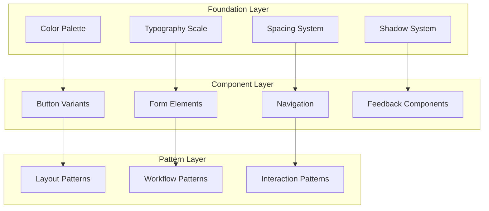

# 🎨 디자인 시스템 문서 (Design System Documentation)

*DogNote 프로젝트의 디자인 시스템, UI/UX 가이드라인, 컴포넌트 라이브러리를 다룹니다.*

---

## 📁 문서 목록

### 🎯 핵심 디자인 문서
| 문서명 | 상태 | 설명 | 최종 업데이트 |
|--------|------|------|---------------|
| [디자인 시스템](./design-system.md) | ✅ 완료 | 디자인 토큰, 색상, 타이포그래피, 간격 체계 | 2025-08-31 |
| [UI 컴포넌트 가이드](./ui-components.md) | ✅ 완료 | 재사용 가능한 UI 컴포넌트 명세 및 사용법 | 2025-08-31 |
| [접근성 가이드](./accessibility-guidelines.md) | 🔄 진행중 | WCAG 2.1 AA 준수 가이드라인 | - |

### 📊 상세 설계 문서  
| 문서명 | 상태 | 설명 | 최종 업데이트 |
|--------|------|------|---------------|
| [인터랙션 패턴](./interaction-patterns.md) | 📋 계획됨 | 사용자 인터랙션 및 애니메이션 가이드 | - |
| [반응형 디자인](./responsive-design.md) | 📋 계획됨 | 브레이크포인트 및 레이아웃 전략 | - |
| [브랜드 가이드라인](./brand-guidelines.md) | 📋 계획됨 | 로고, 아이콘, 브랜드 컬러 사용법 | - |

---

## 🎯 디자인 시스템 개요

### 디자인 철학
> **"반려견과 함께하는 일상을 더욱 쉽고 즐겁게"**
> 
> DogNote의 디자인은 사용자와 반려견 모두를 위한 직관적이고 따뜻한 경험을 제공합니다.

### 핵심 원칙

#### 1. **사용자 중심 (User-Centric)**
```
👤 사용자의 목표와 감정을 최우선으로 고려
🐕 반려견의 특성과 니즈도 함께 반영
⚡ 빠르고 효율적인 태스크 완료 지원
```

#### 2. **일관성 (Consistency)**
```  
🎨 통일된 디자인 언어 사용
🧩 재사용 가능한 컴포넌트 시스템
📐 예측 가능한 인터랙션 패턴
```

#### 3. **접근성 (Accessibility)**
```
♿ WCAG 2.1 AA 표준 준수
🎯 다양한 사용자의 니즈 고려
📱 모든 디바이스에서 동일한 경험
```

---

## 🎨 디자인 시스템 구조

### 디자인 토큰 계층



### 기술 스택 연동

| 기술 | 역할 | 구현 방식 |
|------|------|-----------|
| **Tailwind CSS** | 유틸리티 스타일링 | Custom Design Tokens |
| **Radix UI** | 접근성 프리미티브 | Headless Components |
| **shadcn/ui** | 스타일링된 컴포넌트 | Tailwind + Radix 조합 |
| **CVA** | 컴포넌트 변형 관리 | Class Variance Authority |
| **Framer Motion** | 애니메이션 | Motion Components |

---

## 🎨 핵심 디자인 요소

### 컬러 시스템
```typescript
// 기본 색상 팔레트
export const colors = {
  primary: {
    50: '#f0f9ff',   // 매우 밝은 블루 (배경)
    100: '#e0f2fe',  // 밝은 블루 (호버)
    500: '#3b82f6',  // 메인 블루 (기본)
    600: '#2563eb',  // 진한 블루 (클릭)
    900: '#1e3a8a',  // 매우 진한 블루 (텍스트)
  },
  semantic: {
    success: '#10b981',  // 성공 (산책 완료)
    warning: '#f59e0b',  // 경고 (주의사항)
    error: '#ef4444',    // 에러 (문제 발생)
    info: '#3b82f6',     // 정보 (알림)
  },
  neutral: {
    50: '#f9fafb',   // 배경
    100: '#f3f4f6',  // 카드 배경
    500: '#6b7280',  // 보조 텍스트
    900: '#111827',  // 메인 텍스트
  },
} as const;
```

### 타이포그래피 스케일
```typescript
export const typography = {
  fontFamily: {
    sans: ['Pretendard', 'Inter', 'system-ui', 'sans-serif'],
    mono: ['JetBrains Mono', 'Monaco', 'monospace'],
  },
  fontSize: {
    xs: ['0.75rem', { lineHeight: '1rem' }],      // 12px
    sm: ['0.875rem', { lineHeight: '1.25rem' }],  // 14px
    base: ['1rem', { lineHeight: '1.5rem' }],     // 16px
    lg: ['1.125rem', { lineHeight: '1.75rem' }],  // 18px
    xl: ['1.25rem', { lineHeight: '1.75rem' }],   // 20px
    '2xl': ['1.5rem', { lineHeight: '2rem' }],    // 24px
    '3xl': ['1.875rem', { lineHeight: '2.25rem' }], // 30px
  },
} as const;
```

### 간격 시스템
```typescript
export const spacing = {
  px: '1px',
  0: '0px',
  1: '0.25rem',  // 4px
  2: '0.5rem',   // 8px
  3: '0.75rem',  // 12px
  4: '1rem',     // 16px
  5: '1.25rem',  // 20px
  6: '1.5rem',   // 24px
  8: '2rem',     // 32px
  10: '2.5rem',  // 40px
  12: '3rem',    // 48px
  16: '4rem',    // 64px
  20: '5rem',    // 80px
} as const;
```

---

## 🧩 컴포넌트 라이브러리

### 계층 구조
```
src/components/
├── ui/                    # 기본 UI 컴포넌트
│   ├── Button.tsx         # 버튼 컴포넌트
│   ├── Input.tsx          # 입력 필드
│   ├── Modal.tsx          # 모달 다이얼로그
│   └── Card.tsx           # 카드 컨테이너
├── features/              # 기능별 복합 컴포넌트
│   ├── walk/              # 산책 관련 컴포넌트
│   ├── dogs/              # 반려견 관리 컴포넌트
│   └── dashboard/         # 대시보드 컴포넌트
└── layouts/               # 레이아웃 컴포넌트
    ├── PageLayout.tsx     # 페이지 기본 레이아웃
    └── Navigation.tsx     # 네비게이션 바
```

### 컴포넌트 명명 규칙
```typescript
// ✅ 좋은 예
<Button variant="primary" size="lg">
  산책 시작
</Button>

<DogCard 
  dog={dogData} 
  onSelect={handleSelect}
  showHealthStatus 
/>

<WalkTracker
  isActive={true}
  onStart={handleStart}
  onPause={handlePause}
/>

// ❌ 나쁜 예
<button className="btn-primary-lg">산책 시작</button>
<div className="dog-card-component">...</div>
```

---

## 📱 반응형 디자인

### 브레이크포인트
```typescript
export const breakpoints = {
  sm: '640px',   // 모바일 (가로)
  md: '768px',   // 태블릿 (세로)
  lg: '1024px',  // 태블릿 (가로) / 데스크톱 (소)
  xl: '1280px',  // 데스크톱 (중)
  '2xl': '1536px', // 데스크톱 (대)
} as const;

// 모바일 퍼스트 접근법
export const queries = {
  mobile: '@media (max-width: 639px)',
  tablet: '@media (min-width: 640px) and (max-width: 1023px)', 
  desktop: '@media (min-width: 1024px)',
} as const;
```

### 레이아웃 패턴
- **스택 레이아웃**: 모바일에서 세로 나열
- **그리드 레이아웃**: 데스크톱에서 격자 배치
- **플렉스 레이아웃**: 동적 크기 조정

---

## ♿ 접근성 가이드라인

### WCAG 2.1 AA 준수사항

#### 1. **인식 가능성 (Perceivable)**
- 색상만으로 정보를 전달하지 않음
- 충분한 색상 대비 (4.5:1 이상)
- 스크린 리더 호환성

#### 2. **운용 가능성 (Operable)**
- 키보드만으로 모든 기능 접근 가능
- 적절한 포커스 관리
- 충분한 터치 영역 (44x44px 이상)

#### 3. **이해 가능성 (Understandable)**
- 명확하고 일관된 네비게이션
- 에러 메시지 및 도움말 제공
- 예측 가능한 인터랙션

#### 4. **견고성 (Robust)**
- 시맨틱 HTML 사용
- ARIA 속성 적절히 활용
- 다양한 보조 기술 지원

---

## 🔧 개발자 가이드

### 디자인 토큰 사용법
```typescript
// tailwind.config.ts에서 커스텀 토큰 정의
module.exports = {
  theme: {
    extend: {
      colors: {
        primary: {
          50: '#f0f9ff',
          500: '#3b82f6',
          900: '#1e3a8a',
        },
      },
      fontFamily: {
        sans: ['Pretendard', 'Inter', 'sans-serif'],
      },
    },
  },
};

// 컴포넌트에서 사용
<div className="bg-primary-50 text-primary-900 font-sans">
  DogNote
</div>
```

### 컴포넌트 개발 가이드라인

#### 1. **Props 인터페이스 정의**
```typescript
interface ButtonProps extends React.ButtonHTMLAttributes<HTMLButtonElement> {
  variant?: 'primary' | 'secondary' | 'outline' | 'ghost';
  size?: 'sm' | 'md' | 'lg';
  isLoading?: boolean;
  leftIcon?: React.ReactNode;
  rightIcon?: React.ReactNode;
}
```

#### 2. **CVA를 통한 변형 관리**
```typescript
import { cva } from 'class-variance-authority';

const buttonVariants = cva(
  'inline-flex items-center justify-center rounded-md font-medium transition-colors focus:outline-none focus:ring-2',
  {
    variants: {
      variant: {
        primary: 'bg-primary-500 text-white hover:bg-primary-600',
        secondary: 'bg-neutral-100 text-neutral-900 hover:bg-neutral-200',
      },
      size: {
        sm: 'h-8 px-3 text-sm',
        md: 'h-10 px-4 text-base',
        lg: 'h-12 px-6 text-lg',
      },
    },
    defaultVariants: {
      variant: 'primary',
      size: 'md',
    },
  }
);
```

#### 3. **forwardRef 적용**
```typescript
const Button = forwardRef<HTMLButtonElement, ButtonProps>(
  ({ className, variant, size, isLoading, children, ...props }, ref) => {
    return (
      <button
        className={cn(buttonVariants({ variant, size }), className)}
        ref={ref}
        disabled={isLoading}
        {...props}
      >
        {isLoading && <Spinner className="mr-2 h-4 w-4" />}
        {children}
      </button>
    );
  }
);

Button.displayName = 'Button';
```

---

## 📊 디자인 시스템 현황

### ✅ 완료된 구성요소
- [x] **기본 디자인 토큰** - 색상, 타이포그래피, 간격
- [x] **핵심 UI 컴포넌트** - Button, Input, Modal, Card 등
- [x] **접근성 컴포넌트** - ScreenReaderOnly, SkipToContent, FocusManager
- [x] **레이아웃 시스템** - 반응형 그리드, 컨테이너
- [x] **Tailwind 설정** - 커스텀 테마, 유틸리티 클래스

### 🔄 진행 중인 작업
- [ ] **고급 컴포넌트** - DataTable, Dropdown, Tooltip
- [ ] **애니메이션 시스템** - 트랜지션, 마이크로 인터랙션
- [ ] **다크 모드** - 테마 전환 시스템

### 📋 향후 계획
- [ ] **아이콘 시스템** - 커스텀 아이콘 라이브러리
- [ ] **일러스트레이션** - 브랜드 일러스트레이션
- [ ] **데이터 시각화** - 차트 및 그래프 컴포넌트

---

## 🔗 참고 리소스

### 디자인 도구
- **Figma**: UI 디자인 및 프로토타이핑
- **Tailwind CSS**: 유틸리티 CSS 프레임워크  
- **Radix UI**: 접근성 우선 프리미티브
- **shadcn/ui**: 재사용 가능한 컴포넌트 라이브러리

### 관련 문서
- [시스템 아키텍처](../02-architecture/system-architecture.md)
- [기능 명세서](../01-requirements/functional-specifications.md)
- [개발 가이드](../04-development/)

---

## 📞 문의 및 지원

디자인 시스템 관련 문의사항이나 제안사항이 있으시면:
- **Design Lead**: 디자인 시스템 전반
- **Frontend Team**: 컴포넌트 구현 및 기술적 이슈
- **Accessibility Team**: 접근성 가이드라인 및 테스트

---

*본 문서는 디자인 시스템 발전에 따라 지속적으로 업데이트됩니다.*

**문서 히스토리:**
- 2025-08-31: GlobalRules 표준 적용, 종합적인 디자인 시스템 문서화
