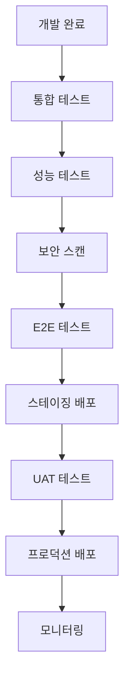

# 🛡️ 품질 보증 (Quality Assurance)

*DogNote 프로젝트의 코드 품질, 테스트, 성능 최적화를 위한 포괄적인 가이드*

---

## 📖 문서 목록

### 🧪 **테스팅 전략**
- **[테스팅 가이드](./testing-guide.md)** - 유닛, 통합, E2E 테스트 전략
- **[테스트 자동화](./test-automation.md)** - CI/CD 파이프라인 테스트 자동화
- **[접근성 테스팅](./accessibility-testing.md)** - WCAG 2.1 AA 준수 테스트

### 📊 **성능 관리**  
- **[성능 최적화](./performance-optimization.md)** - Core Web Vitals, 번들 최적화
- **[성능 모니터링](./performance-monitoring.md)** - 실시간 성능 지표 추적
- **[로드 테스팅](./load-testing.md)** - 서버 부하 테스트 전략

### 🔍 **코드 품질**
- **[코드 리뷰 가이드](./code-review-guide.md)** - PR 리뷰 체크리스트 및 프로세스
- **[정적 분석](./static-analysis.md)** - ESLint, TypeScript, Sonar 설정
- **[기술 부채 관리](./technical-debt.md)** - 기술 부채 식별 및 해결 전략

### 🔒 **보안 품질**
- **[보안 테스팅](./security-testing.md)** - 취약점 스캔 및 침투 테스트
- **[데이터 보호](./data-protection.md)** - 개인정보보호 및 데이터 암호화

---

## 🎯 품질 철학

### 1. **품질 우선 문화**
```
코드 품질은 개발 속도를 늦추는 것이 아니라 
장기적으로 개발 속도를 높이는 투자입니다.

- 예방 > 수정: 버그 예방이 버그 수정보다 효율적
- 자동화 우선: 반복 작업의 자동화로 인적 오류 최소화  
- 지속적 개선: 품질 지표를 통한 지속적 개선
```

### 2. **테스트 피라미드**
```
      ┌─────────────┐
      │   E2E Tests │  < 10%
      │   (Cypress) │
    ┌─┴─────────────┴─┐
    │ Integration Tests │  < 20%
    │  (React Testing)  │
  ┌─┴───────────────────┴─┐
  │     Unit Tests        │  > 70%
  │  (Vitest + Jest)      │
  └───────────────────────┘
```

### 3. **Quality Gates**
```typescript
// CI/CD 파이프라인의 품질 게이트
const qualityGates = {
  commit: {
    linting: 'PASS',           // ESLint 통과
    typeCheck: 'PASS',         // TypeScript 컴파일
    unitTests: 'PASS',         // 유닛 테스트 통과
    coverage: '>= 80%',        // 코드 커버리지
  },
  
  pullRequest: {
    codeReview: '2+ approvals', // 2명 이상 승인
    integrationTests: 'PASS',   // 통합 테스트
    accessibility: 'PASS',      // 접근성 테스트
    performance: 'no regression', // 성능 회귀 없음
  },
  
  release: {
    e2eTests: 'PASS',          // E2E 테스트
    securityScan: 'PASS',      // 보안 스캔
    loadTest: 'PASS',          // 부하 테스트
    documentation: 'UPDATED',   // 문서 업데이트
  },
} as const;
```

---

## 🔧 품질 도구 스택

### **테스팅**
- **Unit Testing**: Vitest + @testing-library/react
- **Integration Testing**: React Testing Library + MSW
- **E2E Testing**: Cypress + Playwright (선택)
- **Visual Testing**: Chromatic (Storybook 연동)

### **코드 품질**
- **Linting**: ESLint + @typescript-eslint
- **Formatting**: Prettier
- **Type Checking**: TypeScript (strict mode)
- **Pre-commit**: Husky + lint-staged

### **성능 모니터링**
- **Core Web Vitals**: Next.js built-in analytics
- **Bundle Analysis**: @next/bundle-analyzer
- **Performance Profiling**: React DevTools Profiler
- **Real User Monitoring**: Firebase Performance

### **보안 도구**
- **Dependency Scanning**: npm audit + Snyk
- **Static Analysis**: CodeQL + SonarQube
- **Secret Detection**: GitLeaks
- **Container Scanning**: Trivy (if using containers)

---

## 📊 품질 지표 (KPIs)

### **코드 품질 지표**
```typescript
interface QualityMetrics {
  // 테스트 커버리지
  testCoverage: {
    unit: number;        // > 80%
    integration: number; // > 60%
    e2e: number;        // > 40%
  };
  
  // 코드 복잡도
  complexity: {
    cyclomaticComplexity: number;  // < 10 per function
    maintainabilityIndex: number; // > 70
  };
  
  // 버그 관련
  bugs: {
    defectDensity: number;        // < 1 bug per 1000 lines
    bugFixTime: number;           // < 24 hours (critical)
    regressionRate: number;       // < 5%
  };
  
  // 성능 지표
  performance: {
    firstContentfulPaint: number; // < 1.8s
    largestContentfulPaint: number; // < 2.5s
    cumulativeLayoutShift: number;  // < 0.1
    firstInputDelay: number;       // < 100ms
  };
}
```

### **품질 대시보드**
```
📈 Daily Quality Dashboard

┌─────────────────────────────────────┐
│ Test Coverage    │ 87.3% ✅        │
│ Build Success    │ 98.2% ✅        │  
│ Bug Density      │ 0.8/1K ✅       │
│ Performance      │ 92/100 ✅       │
│ Security Score   │ A+ ✅           │
└─────────────────────────────────────┘

🔴 Critical Issues: 0
🟡 Warning Issues: 3
🟢 All Systems: Operational
```

---

## 🚀 품질 보증 프로세스

### **개발 프로세스**
1. **코드 작성**: TDD 방식으로 테스트 먼저 작성
2. **로컬 검증**: pre-commit 훅으로 기본 품질 검사
3. **PR 생성**: 품질 체크리스트 확인
4. **자동 검사**: CI 파이프라인 실행
5. **코드 리뷰**: 팀원 리뷰 및 승인
6. **머지**: 모든 품질 게이트 통과 후 머지

### **릴리스 프로세스**


### **버그 트리아지**
```typescript
// 버그 우선순위 매트릭스
const bugPriority = {
  critical: {
    // P0: 서비스 중단, 데이터 손실
    sla: '2 hours',
    assignees: ['lead-dev', 'senior-dev'],
    escalation: 'immediate',
  },
  
  high: {
    // P1: 주요 기능 오류
    sla: '24 hours', 
    assignees: ['senior-dev'],
    escalation: 'next-business-day',
  },
  
  medium: {
    // P2: 부분적 기능 오류
    sla: '1 week',
    assignees: ['any-dev'],
    escalation: 'sprint-planning',
  },
  
  low: {
    // P3: 사소한 UI/UX 이슈
    sla: '2 weeks',
    assignees: ['junior-dev'],
    escalation: 'backlog',
  },
} as const;
```

---

## ✅ Definition of Done (완료 정의)

### **기능 개발 완료 기준**
- [ ] **요구사항**: 기능 명세서 요구사항 100% 충족
- [ ] **코드 리뷰**: 2명 이상 승인 완료  
- [ ] **테스트**: 유닛/통합 테스트 작성 및 통과
- [ ] **접근성**: WCAG 2.1 AA 준수 확인
- [ ] **성능**: Core Web Vitals 기준 만족
- [ ] **보안**: 보안 취약점 스캔 통과
- [ ] **문서화**: API 문서 및 사용법 업데이트
- [ ] **배포**: 스테이징 환경 테스트 통과

### **릴리스 완료 기준**
- [ ] **기능 테스트**: 모든 신규/수정 기능 검증
- [ ] **회귀 테스트**: 기존 기능 영향도 확인
- [ ] **성능 테스트**: 부하 테스트 및 성능 회귀 없음
- [ ] **보안 테스트**: 침투 테스트 및 취약점 해결
- [ ] **UAT**: 사용자 수용 테스트 통과
- [ ] **롤백 계획**: 배포 롤백 시나리오 준비
- [ ] **모니터링**: 배포 후 모니터링 체계 준비

---

## 📚 교육 및 트레이닝

### **필수 교육 과정**
1. **테스팅 기초**: 테스트 작성법, TDD 개념
2. **성능 최적화**: Web Vitals, 번들 최적화
3. **보안 코딩**: OWASP Top 10, 보안 베스트 프랙티스
4. **접근성**: WCAG 가이드라인, 스크린 리더 사용법

### **정기 워크샵**
- **월간 코드 리뷰**: 우수 사례 공유
- **분기별 기술 세미나**: 새로운 도구 및 기법
- **연 2회 해커톤**: 품질 개선 아이디어 구현

---

## 🔗 외부 리소스

### **학습 자료**
- **[Testing Library 문서](https://testing-library.com/docs/)**
- **[Web.dev 성능 가이드](https://web.dev/performance/)**
- **[OWASP 보안 가이드](https://owasp.org/www-project-web-security-testing-guide/)**
- **[WCAG 접근성 가이드](https://www.w3.org/WAI/WCAG21/quickref/)**

### **도구 문서**
- **[Vitest 공식 문서](https://vitest.dev/)**
- **[Cypress 가이드](https://docs.cypress.io/)**
- **[ESLint 규칙](https://eslint.org/docs/rules/)**

---

## 📞 품질 담당자

- **QA Lead**: @qa-lead
- **Test Automation**: @test-automation-lead  
- **Performance**: @performance-lead
- **Security**: @security-lead

---

*품질은 하루아침에 이루어지지 않습니다. 지속적인 개선과 팀원 모두의 노력이 필요합니다.*

**문서 히스토리:**
- v1.0: 2025-08-31 (품질보증 가이드 체계 구축, GlobalRules 표준 적용)
