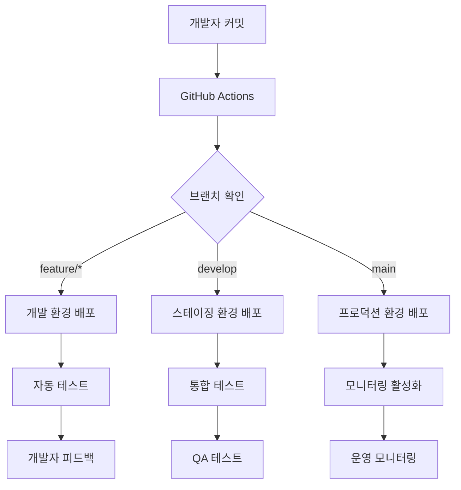

# ⚙️ 운영 및 배포 (Operations & Deployment)

_DogNote 프로젝트의 운영, 배포, 모니터링을 위한 포괄적인 가이드_

---

## 📖 문서 목록

### 🚀 **배포 및 인프라**

- **[배포 가이드](./deployment-guide.md)** - Vercel, Firebase 배포 프로세스
- **[환경 관리](./environment-management.md)** - 개발/스테이징/프로덕션 환경 설정
- **[CI/CD 파이프라인](./cicd-pipeline.md)** - GitHub Actions 자동화 워크플로우

### 📊 **모니터링 및 관찰성**

- **[모니터링 설정](./monitoring-setup.md)** - Firebase Analytics, Performance 모니터링
- **[로깅 전략](./logging-strategy.md)** - 구조화된 로깅 및 오류 추적
- **[알림 시스템](./alerting-system.md)** - 장애 감지 및 알림 설정

### 🔒 **보안 및 백업**

- **[보안 운영](./security-operations.md)** - 보안 점검, 취약점 관리
- **[백업 전략](./backup-strategy.md)** - 데이터 백업 및 복구 계획
- **[재해 복구](./disaster-recovery.md)** - 비즈니스 연속성 계획

### 📈 **성능 및 확장성**

- **[성능 튜닝](./performance-tuning.md)** - 애플리케이션 성능 최적화
- **[확장성 계획](./scalability-planning.md)** - 트래픽 증가 대응 전략

---

## 🎯 운영 철학

### 1. **Site Reliability Engineering (SRE) 원칙**

```
신뢰성 = (전체 시간 - 장애 시간) / 전체 시간 × 100

목표 SLA:
- 가용성: 99.9% (월 43분 이하 장애)
- 응답시간: 95%ile < 2초
- 오류율: < 0.1%
- 복구시간: MTTR < 30분
```

### 2. **DevOps 문화**

- **자동화 우선**: 수동 작업의 최소화
- **장애 대응**: Blameless Postmortem 문화
- **지속적 개선**: 메트릭 기반 의사결정
- **협업**: 개발팀과 운영팀의 긴밀한 협력

### 3. **운영 원칙**

```typescript
const operationalPrinciples = {
  automation: {
    deploy: 'Zero-touch deployment',
    testing: 'Automated quality gates',
    monitoring: 'Self-healing systems',
    scaling: 'Auto-scaling based on metrics',
  },

  observability: {
    logging: 'Structured logging with correlation IDs',
    metrics: 'Business and technical metrics',
    tracing: 'Distributed request tracing',
    alerting: 'Actionable alerts only',
  },

  reliability: {
    redundancy: 'Multi-region deployment',
    backups: 'Automated daily backups',
    testing: 'Chaos engineering practices',
    recovery: 'Tested disaster recovery plans',
  },
} as const;
```

---

## 🏗️ 인프라 아키텍처

### **프로덕션 환경**

```
┌─────────────────────────────────────────┐
│              Vercel Edge Network        │
│  (CDN, Static Assets, API Routes)      │
└─────────────┬───────────────────────────┘
              │
              │ HTTPS/HTTP2
              │
┌─────────────▼───────────────────────────┐
│         Next.js Application             │
│    (Server-Side Rendering, API)        │
└─────────────┬───────────────────────────┘
              │
              │ Firebase SDK
              │
┌─────────────▼───────────────────────────┐
│           Firebase Services             │
│                                         │
│  ┌─────────────┐  ┌─────────────────┐   │
│  │ Firestore   │  │   Authentication │   │
│  │ Database    │  │   (Auth, Users) │   │
│  └─────────────┘  └─────────────────┘   │
│                                         │
│  ┌─────────────┐  ┌─────────────────┐   │
│  │ Cloud       │  │   Cloud Storage │   │
│  │ Functions   │  │   (Images, Files) │  │
│  └─────────────┘  └─────────────────┘   │
└─────────────────────────────────────────┘
```

### **개발/스테이징 파이프라인**



---

## 🚀 배포 환경

### **환경별 설정**

```typescript
interface EnvironmentConfig {
  name: string;
  domain: string;
  firebaseProject: string;
  monitoring: boolean;
  analytics: boolean;
  performance: boolean;
}

export const environments: Record<string, EnvironmentConfig> = {
  development: {
    name: 'Development',
    domain: 'https://dognote-dev.vercel.app',
    firebaseProject: 'dognote-dev-12345',
    monitoring: false,
    analytics: false,
    performance: false,
  },

  staging: {
    name: 'Staging',
    domain: 'https://dognote-staging.vercel.app',
    firebaseProject: 'dognote-staging-12345',
    monitoring: true,
    analytics: false,
    performance: true,
  },

  production: {
    name: 'Production',
    domain: 'https://dognote.app',
    firebaseProject: 'dognote-prod-12345',
    monitoring: true,
    analytics: true,
    performance: true,
  },
} as const;
```

### **배포 전략**

- **개발 환경**: 모든 feature 브랜치 자동 배포
- **스테이징 환경**: develop 브랜치 머지 시 자동 배포
- **프로덕션 환경**: main 브랜치 태그 생성 시 배포

---

## 📊 핵심 지표 (KPIs)

### **기술적 지표**

```typescript
interface TechnicalMetrics {
  // 가용성
  uptime: number; // 99.9% 목표
  mtbf: number; // 평균 장애 간격 (시간)
  mttr: number; // 평균 복구 시간 (분)

  // 성능
  responseTime: {
    p50: number; // < 1초
    p95: number; // < 2초
    p99: number; // < 3초
  };

  // 오류율
  errorRate: number; // < 0.1%
  serverErrors: number; // 5xx 응답
  clientErrors: number; // 4xx 응답

  // 리소스 사용량
  cpuUsage: number; // < 80%
  memoryUsage: number; // < 85%
  diskUsage: number; // < 90%
}
```

### **비즈니스 지표**

```typescript
interface BusinessMetrics {
  // 사용자 활동
  dailyActiveUsers: number;
  monthlyActiveUsers: number;
  userRetention: {
    day1: number; // 1일 리텐션
    day7: number; // 7일 리텐션
    day30: number; // 30일 리텐션
  };

  // 핵심 기능 사용률
  walksSarted: number; // 시작된 산책 수
  walksCompleted: number; // 완료된 산책 수
  photosUploaded: number; // 업로드된 사진 수

  // 성능 영향
  bounceRate: number; // 이탈률
  sessionDuration: number; // 평균 세션 시간
  pageLoadAbandon: number; // 로딩 중 이탈률
}
```

---

## 🚨 알림 및 대응

### **알림 등급**

```typescript
const alertLevels = {
  critical: {
    // P0: 서비스 전체 장애
    examples: ['전체 서비스 다운', 'DB 연결 실패', '인증 시스템 장애'],
    response: '즉시 대응 (15분 이내)',
    escalation: '30분 후 매니저 에스컬레이션',
    channels: ['PagerDuty', 'Slack', 'SMS', 'Phone'],
  },

  warning: {
    // P1: 주요 기능 장애
    examples: ['높은 오류율', '느린 응답시간', '일부 기능 오류'],
    response: '1시간 이내 대응',
    escalation: '2시간 후 에스컬레이션',
    channels: ['Slack', 'Email'],
  },

  info: {
    // P2: 성능 저하 또는 경고
    examples: ['리소스 사용량 증가', '비정상적 트래픽 패턴'],
    response: '영업시간 내 확인',
    escalation: '24시간 후 에스컬레이션',
    channels: ['Slack'],
  },
} as const;
```

### **온콜 로테이션**

```
주차별 온콜 담당:
- 1주차: Senior Developer A
- 2주차: Senior Developer B
- 3주차: DevOps Engineer
- 4주차: Tech Lead

온콜 책임:
✅ 알림 모니터링 (24/7)
✅ P0/P1 장애 즉시 대응
✅ 주간 인시던트 리포트 작성
✅ 다음 온콜자에게 인수인계
```

---

## 🔄 변경 관리

### **배포 승인 프로세스**

```typescript
interface DeploymentApproval {
  environment: 'development' | 'staging' | 'production';
  requiredApprovals: number;
  approvers: string[];
  checks: string[];
}

const deploymentRules: Record<string, DeploymentApproval> = {
  production: {
    environment: 'production',
    requiredApprovals: 2,
    approvers: ['tech-lead', 'senior-dev-1', 'senior-dev-2'],
    checks: [
      'all-tests-pass',
      'security-scan-pass',
      'performance-regression-check',
      'feature-flag-configuration',
    ],
  },

  staging: {
    environment: 'staging',
    requiredApprovals: 1,
    approvers: ['any-senior-dev'],
    checks: ['all-tests-pass', 'build-success'],
  },
};
```

### **릴리스 노트 템플릿**

```markdown
# 릴리스 v2.1.0 - 2025-09-15

## 🚀 새로운 기능

- 산책 경로 공유 기능 추가
- 반려견 건강 기록 차트 개선

## 🐛 버그 수정

- 위치 추적 정확도 개선
- 사진 업로드 실패 문제 해결

## ⚡ 성능 개선

- 초기 로딩 시간 20% 단축
- 메모리 사용량 15% 감소

## 🔒 보안 업데이트

- 사용자 데이터 암호화 강화
- API 인증 로직 개선

## 🔧 기술적 변경

- Next.js 14.2 업그레이드
- Firebase SDK v10 마이그레이션

## 📋 Migration Guide

- 환경 변수 업데이트 필요: `NEXT_PUBLIC_NEW_FEATURE_FLAG=true`
- Firestore 인덱스 재구성 필요
```

---

## 🛠️ 운영 도구

### **모니터링 스택**

- **APM**: Firebase Performance Monitoring
- **Logs**: Vercel Function Logs + Firebase Logging
- **Metrics**: Google Analytics 4 + Custom Dashboards
- **Uptime**: UptimeRobot + Firebase App Check
- **Alerting**: Firebase Crashlytics + Slack Webhooks

### **개발 도구**

- **CI/CD**: GitHub Actions
- **Infrastructure**: Vercel + Firebase
- **Secrets**: Vercel Environment Variables
- **Documentation**: GitHub Wiki + Notion

---

## 📚 운영 매뉴얼

### **일상 운영 체크리스트**

- [ ] **매일**: 대시보드 확인, 오류율 점검
- [ ] **매주**: 성능 리포트 검토, 백업 상태 확인
- [ ] **매월**: 보안 패치 적용, 비용 최적화 검토
- [ ] **분기별**: 재해 복구 훈련, 용량 계획 업데이트

### **인시던트 대응 절차**

1. **탐지**: 모니터링 알림 또는 사용자 신고
2. **분류**: 심각도 판정 (P0/P1/P2/P3)
3. **초기 대응**: 임시 해결 또는 서비스 격리
4. **조사**: 근본 원인 분석
5. **해결**: 영구적 수정 적용
6. **사후 분석**: Postmortem 작성 및 개선점 도출

---

## 📞 연락처

### **운영팀**

- **DevOps Lead**: @devops-lead
- **Site Reliability Engineer**: @sre
- **Database Administrator**: @dba
- **Security Engineer**: @security

### **에스컬레이션**

- **Tech Lead**: @tech-lead (P0/P1 장애)
- **Engineering Manager**: @eng-manager (장기 장애)
- **CTO**: @cto (비즈니스 임팩트 이슈)

---

_안정적인 서비스 운영은 사용자 만족과 비즈니스 성공의 핵심입니다._

**문서 히스토리:**

- v1.0: 2025-08-31 (운영 및 배포 가이드 체계 구축, SRE 원칙 적용)
