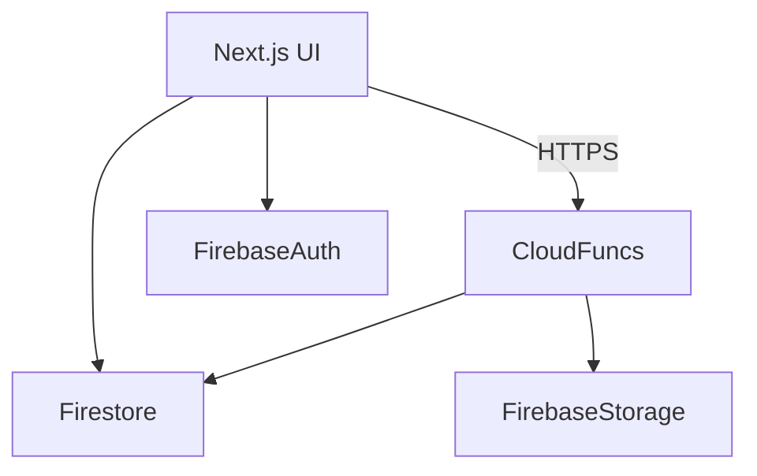

# 도그노트 개발 명세서 (v0.1)

*최종 업데이트: 2025‑08‑03*

---

## 목차

1. [개요](https://chatgpt.com/g/g-p-67aafce5aaac8191bf301cda01fae8c2-dognote/c/688ebed3-2414-8329-9ad8-a0c841493c32#%EA%B0%9C%EC%9A%94)
2. [기술 스택](https://chatgpt.com/g/g-p-67aafce5aaac8191bf301cda01fae8c2-dognote/c/688ebed3-2414-8329-9ad8-a0c841493c32#%EA%B8%B0%EC%88%A0-%EC%8A%A4%ED%83%9D)
3. [솔루션 아키텍처](https://chatgpt.com/g/g-p-67aafce5aaac8191bf301cda01fae8c2-dognote/c/688ebed3-2414-8329-9ad8-a0c841493c32#%EC%86%94%EB%A3%A8%EC%85%98-%EC%95%84%ED%82%A4%ED%85%8D%EC%B2%98)
4. [디렉터리 & 모듈 구조](https://chatgpt.com/g/g-p-67aafce5aaac8191bf301cda01fae8c2-dognote/c/688ebed3-2414-8329-9ad8-a0c841493c32#%EB%94%94%EB%A0%89%ED%84%B0%EB%A6%AC--%EB%AA%A8%EB%93%88-%EA%B5%AC%EC%A1%B0)
5. [데이터 모델 & 파이어스토어 스키마](https://chatgpt.com/g/g-p-67aafce5aaac8191bf301cda01fae8c2-dognote/c/688ebed3-2414-8329-9ad8-a0c841493c32#%EB%8D%B0%EC%9D%B4%ED%84%B0-%EB%AA%A8%EB%8D%B8--%ED%8C%8C%EC%9D%B4%EC%96%B4%EC%8A%A4%ED%86%A0%EC%96%B4-%EC%8A%A4%ED%82%A4%EB%A7%88)
6. [인증 & 권한](https://chatgpt.com/g/g-p-67aafce5aaac8191bf301cda01fae8c2-dognote/c/688ebed3-2414-8329-9ad8-a0c841493c32#%EC%9D%B8%EC%A6%9D--%EA%B6%8C%ED%95%9C)
7. [상태 관리 & 데이터 패칭](https://chatgpt.com/g/g-p-67aafce5aaac8191bf301cda01fae8c2-dognote/c/688ebed3-2414-8329-9ad8-a0c841493c32#%EC%83%81%ED%83%9C-%EA%B4%80%EB%A6%AC--%EB%8D%B0%EC%9D%B4%ED%84%B0-%ED%8C%A8%EC%B9%AD)
8. [코어 기능 & UX 명세](https://chatgpt.com/g/g-p-67aafce5aaac8191bf301cda01fae8c2-dognote/c/688ebed3-2414-8329-9ad8-a0c841493c32#%EC%BD%94%EC%96%B4-%EA%B8%B0%EB%8A%A5--ux-%EB%AA%85%EC%84%B8)
9. [API & 클라우드 함수](https://chatgpt.com/g/g-p-67aafce5aaac8191bf301cda01fae8c2-dognote/c/688ebed3-2414-8329-9ad8-a0c841493c32#api--%ED%81%B4%EB%9D%BC%EC%9A%B0%EB%93%9C-%ED%95%A8%EC%88%98)
10. [보안 & 컴플라이언스](https://chatgpt.com/g/g-p-67aafce5aaac8191bf301cda01fae8c2-dognote/c/688ebed3-2414-8329-9ad8-a0c841493c32#%EB%B3%B4%EC%95%88--%EC%BB%B4%ED%94%8C%EB%9D%BC%EC%9D%B4%EC%96%B8%EC%8A%A4)
11. [테스트 전략](https://chatgpt.com/g/g-p-67aafce5aaac8191bf301cda01fae8c2-dognote/c/688ebed3-2414-8329-9ad8-a0c841493c32#%ED%85%8C%EC%8A%A4%ED%8A%B8-%EC%A0%84%EB%9E%B5)
12. [CI/CD & 데브옵스](https://chatgpt.com/g/g-p-67aafce5aaac8191bf301cda01fae8c2-dognote/c/688ebed3-2414-8329-9ad8-a0c841493c32#cicd--%EB%8D%B0%EB%B8%8C%EC%98%B5%EC%8A%A4)
13. [코딩 표준 & 규칙](https://chatgpt.com/g/g-p-67aafce5aaac8191bf301cda01fae8c2-dognote/c/688ebed3-2414-8329-9ad8-a0c841493c32#%EC%BD%94%EB%94%A9-%ED%91%9C%EC%A4%80--%EA%B7%9C%EC%B9%99)
14. [비기능 요구사항](https://chatgpt.com/g/g-p-67aafce5aaac8191bf301cda01fae8c2-dognote/c/688ebed3-2414-8329-9ad8-a0c841493c32#%EB%B9%84%EA%B8%B0%EB%8A%A5-%EC%9A%94%EA%B5%AC%EC%82%AC%ED%95%AD)

---

## 1. 개요

### 목적

DogNote(도그노트)는 반려견의 산책, 건강 기록, 일상을 관리하고, 꾸준한 산책에 대한 인사이트와 게이미피케이션(포인트)을 제공하는 동반자형 웹 애플리케이션입니다.

### 범위

초기 MVP는 **웹(모바일 퍼스트)**를 목표로 하며, Next.js(TypeScript)와 Firebase를 사용합니다. 추후 모바일 앱(React Native 또는 Flutter)을 계획하고 있습니다.

### 목표

- Firebase BaaS로 빠른 MVP 제공
- 재사용성 높은 모듈형 UI
- GPS 기반 정확한 산책 추적 및 거리 계산
- 다중 반려견 지원 및 개별 대시보드
- 안전한 소셜 로그인(구글, 애플 → Firebase Auth) 및 확장 가능한 OAuth(카카오 이후 추가)
- 2단계에서 병원 연동을 위한 건강/예방접종 기록 확장

---

## 2. 기술 스택

| 계층 | 기술 | 비고 |
| --- | --- | --- |
| **프론트엔드** | Next.js 14 (App Router) + TypeScript | 필요 시 RSC 점진 도입 |
|  | React 18 | `const Comp = ({...}: Props) => {}` 패턴 |
|  | Tailwind CSS ^3 + SCSS Modules | 디자인 토큰 & 복합 스타일은 SCSS, 빠른 스타일은 Tailwind |
|  | Zustand ^5 | 경량 전역 상태 |
|  | React-Query ^5 | 데이터 패칭 & 캐싱 |
|  | 지도/GPS | react‑leaflet + Leaflet 1.9(웹) → expo‑location(RN) |
| **Backend-as-a-Service** | Firebase SDK ^10 | Firestore, Auth, Storage, Cloud Functions, Gemini AI |
| **인증** | NextAuth.js ^5 + Firebase Auth | 구글·애플 현재, 카카오는 2단계 |
| **DevOps** | GitHub + GitHub Actions → Vercel | feature → develop → main, SonarQube 품질 게이트 |
| **테스트** | Jest ^30, React Testing Library ^15 | 커버리지 80% 이상 |
| **디자인** | Figma, Lucidchart | UI 시안, 아키텍처 다이어그램 |

---

## 3. 솔루션 아키텍처



- **App Router**: 정적 프리렌더 + CSR 혼합.
- **Cloud Functions**: 권한이 필요한 로직(포인트 합산, 예약 알림, 병원 동기화).
- **보안 규칙**: 사용자 ID & 반려견 하위 컬렉션 단위 격리.

---

## 4. 디렉터리 & 모듈 구조

```
src/
 ├─ app/                 # Next.js App Router (pages & layouts)
 ├─ components/
 │   ├─ ui/              # 기본 UI(버튼 등)
 │   ├─ layout/          # 레이아웃, 사이드메뉴, 헤더
 │   ├─ walks/           # 산책 UI
 │   ├─ dogs/            # 반려견 프로필
 │   └─ auth/            # 인증 컴포넌트
 ├─ hooks/               # 커스텀 훅
 ├─ lib/
 │   ├─ firebase.ts      # Firebase 초기화(dognote-dev)
 │   ├─ geoutils.ts      # 하버사인 거리 계산
 │   └─ api/             # Firestore 래퍼
 ├─ types/               # 도메인 타입 정의
 ├─ styles/              # SCSS & Tailwind
 ├─ tests/               # Jest 테스트
 └─ .env.local           # 개발 환경 변수

```

원칙:

- **모듈화**: 도메인 vs UI 코어 분리
- **가독성** 우선, 과도한 DRY 지양
- **순환 참조 금지**(ESLint)

---

## 5. 데이터 모델 & 파이어스토어 스키마

### 컬렉션 & 문서

| 컬렉션 | Doc ID | 필드 | 서브 컬렉션 |
| --- | --- | --- | --- |
| `users` | `uid` | `displayName`, `email`, `createdAt`, `onboardingCompleted`, `providerIds[]` | `dogs` |
| `users/{uid}/dogs` | `dogId` | `name`, `birth`, `breed`, `avatarUrl`, `weightKg`, `createdAt`, `mood` | `walks`, `healthRecords`, `vaccinations` |
| `users/{uid}/dogs/{dogId}/walks` | `walkId(자동)` | `startedAt`, `endedAt`, `distanceMeters`, `pathGeoJSON`, `issues[]`, `note`, `pointsEarned` | — |
| `users/{uid}/dogs/{dogId}/healthRecords` | `recordId` | `type`, `value`, `recordedAt`, `note` | — |
| `users/{uid}/dogs/{dogId}/vaccinations` | `vaccId` | `vaccineName`, `dueDate`, `done`, `clinicId?` | — |

### 보안 규칙(발췌)

```
rules_version = '2';
service cloud.firestore {
  match /databases/{database}/documents {
    function isSignedIn() { return request.auth != null; }

    match /users/{uid} {
      allow read, write: if isSignedIn() && uid == request.auth.uid;

      match /dogs/{dogId} {
        allow read, write: if isSignedIn() && uid == request.auth.uid;

        match /{sub=walks|healthRecords|vaccinations}/{docId} {
          allow read, write: if isSignedIn() && uid == request.auth.uid;
        }
      }
    }
  }
}

```

---

## 6. 인증 & 권한

- **NextAuth 어댑터**: 커스텀 Firebase 어댑터
- **프로바이더**
    - GoogleProvider (운영)
    - AppleProvider (운영)
    - KakaoProvider (2단계)
- **JWT**: NextAuth 서명, `httpOnly` 쿠키 저장
- **역할 모델**: 초기 `user`만, `admin`은 커스텀 클레임

---

## 7. 상태 관리 & 데이터 패칭

| 관심사 | 도구 | 상세 |
| --- | --- | --- |
| 인증 세션 | `next-auth/react` | `useSession()` + `<SessionProvider>` |
| 전역 UI(사이드메뉴, 선택된 강아지) | Zustand | `sessionStorage` 지속 |
| 서버 상태 | React‑Query | 쿼리 키: `['dogs']`, `['walks', dogId]` 등 |
| 캐싱 | React‑Query + Firestore 오프라인 캐시 | SWR 패턴 |

---

## 8. 코어 기능 & UX 명세

### 8.1 메인 화면(Home)

- **헤더**: `[메뉴][로고][강아지 전환]` (#23)
- **강아지 썸네일** + 기분 아이콘(#27)
- **최근 일정** 1–2개 요약 (#22)
- **빠른 실행 버튼**: 산책 시작, 건강 기록 추가
- **반응형**: 모바일(<640px) 우선
- **접근성**: aria‑label, 키보드 내비게이션

### 8.2 산책 추적 플로우

1. **“산책 시작”** → `startedAt` 기록 & GPS 시작
2. 실시간 polyline 렌더 + 하버사인 거리 누적
3. **취소** 시 확인 다이얼로그; 확인 시 draft 삭제(#36‑3)
4. **종료** 후 이슈 선택 및 메모 입력 모달
5. 저장 → 포인트 계산(100m당 1pt), Cloud Function에서 합산

### 8.3 산책 대시보드(#28)

- 월별 평균 거리(막대 차트)
- 주간 산책 빈도(서술형)
- 누적 포인트
- 최근 2회 산책 리스트 + "더보기"

### 8.4 다중 반려견 지원

- 헤더 전환 버튼: `dogs.length > 1` 시 노출
- 산책 시작 시 다중 선택 가능(#36‑1); `dogIds[]` 저장

### 8.5 건강 & 예방접종

- 예방접종 알림: Cloud Function 매일, 7일 전 FCM/WebPush
- 건강 기록 타입: 체중, 약 복용, 병원 방문 등

---

## 9. API & 클라우드 함수

| 함수 | 트리거 | 설명 |
| --- | --- | --- |
| `aggregatePointsOnWalkWrite` | `walks` 문서 작성 | 거리 기반 포인트 지갑에 추가 |
| `sendVaccinationReminder` | Crontab 하루 1회 | 7일 내 dueDate 조회 후 알림 |
| `cleanupOldDraftWalks` | 매시간 | 2시간 초과 미완료 draft 삭제 |
| `syncClinicRecords` | HTTPS 호출(2단계) | 병원 API 동기화 |

---

## 10. 보안 & 컴플라이언스

- **Firestore 규칙**: §5 참조
- **Storage 규칙**: `/users/{uid}/dogs/{dogId}/avatar.*` 경로 제한
- **환경 변수**: `.env.local` 비밀, `NEXT_PUBLIC_` 금지
- **GDPR/개인정보보호법**: 탈퇴 시 개인정보 삭제
- **감사 로그**: Firebase Audit Logs

---

## 11. 테스트 전략

| 계층 | 도구 | 커버리지 목표 |
| --- | --- | --- |
| UI 컴포넌트 | RTL + Jest | 90% |
| 훅 | Jest | 90% |
| 클라우드 함수 | Firebase Emulator + Jest | 80% |
| E2E | Playwright | 로그인, 산책 추가, 대시보드 |

`develop` 브랜치 커버리지 < 80% 시 머지 금지(SonarQube).

---

## 12. CI/CD & 데브옵스

1. **브랜치 전략**: `feature/*` → PR → `develop` → QA → `main` 배포
2. **GitHub Actions**
    - 의존성 설치 & 캐시
    - `npm run lint && npm test`
    - SonarQube 분석(QG ≥ 80%)
    - Vercel 배포
3. **버전 태깅**: Semantic Versioning `vX.Y.Z`

---

## 13. 코딩 표준 & 규칙

- **TypeScript strict** 활성화
- **ESLint + Prettier** pre‑commit(husky)
- **커밋 스타일**: Conventional Commits (예: `feat(walks): GPS 경로 캡처 추가`)
- **컴포넌트 작성**: `FC<Props>` 사용 금지 (#31)
- **SCSS**: §32 구조 준수, Tailwind 중복 자제

---

## 14. 비기능 요구사항

| 카테고리 | 목표 |
| --- | --- |
| 성능 | FCP 2초 이하(4G) |
| 접근성 | WCAG 2.1 AA |
| 가용성 | 월 99.5% |
| 확장성 | 무상 Firebase 플랜 기준 1만 DAU |
| 유지보수성 | 함수 복잡도 10 이하 |

---
