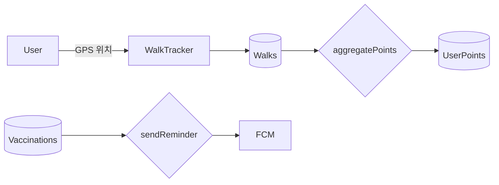

# 도그노트 기능 명세서 (v0.1)

*최종 업데이트: 2025-08-03*

---

## 1. 목표 & 범위

| 구분 | 내용 |
| --- | --- |
| **제품 비전** | 반려견의 일상·건강·산책을 한곳에서 관리하고, 데이터 기반 인사이트와 보상을 제공하는 “반려견 라이프로그 플랫폼” |
| **초기 목표(MVP)** | 로그인(구글·애플), 다중 반려견 등록, GPS 산책 추적, 대시보드, 건강·예방접종 기록, 포인트 적립 |
| **대상 플랫폼** | 모바일 웹(Responsive) → 추후 PWA/React Native 확장 |

---

## 2. 주요 사용자 시나리오(User Scenario)

1. **신규 사용자**가 소셜 계정으로 가입 후 첫 반려견 정보를 등록한다.
2. **사용자**가 "산책 시작" 버튼을 눌러 GPS 경로와 거리를 자동 기록한다.
3. 산책 종료 후 **사용자**가 이슈(빗길·과도한 더위 등)를 선택하고 메모를 남긴 뒤 저장한다.
4. 메인 대시보드에서 **사용자**가 최근 산책 통계와 포인트 내역을 확인한다.
5. **사용자**가 예방접종 예정일 알림을 받고, 기록을 완료 상태로 변경한다.
6. 다두(多頭) 가정에서 **사용자**가 헤더 스위처로 다른 반려견 정보를 조회한다.

---

## 3. 기능 요구사항(Functional Requirements)

### 3.1 사용자 인증/계정

| ID | 기능 | 설명 | 우선순위 |
| --- | --- | --- | --- |
| AUTH‑01 | 소셜 로그인 | Google, Apple 계정으로 OAuth 로그인/가입 | Must |
| AUTH‑02 | 세션 관리 | JWT + httpOnly 쿠키, 7일 자동 로그인 | Must |
| AUTH‑03 | 카카오 로그인 | Kakao OAuth 추가 | Should(Phase 2) |

### 3.2 반려견 프로필 관리

| ID | 기능 | 설명 | 우선순위 |
| --- | --- | --- | --- |
| DOG‑01 | 반려견 등록 | 이름·품종·생일·몸무게·아바타 업로드 | Must |
| DOG‑02 | 다중 반려견 지원 | 다수 등록 및 헤더 스위칭 | Must |
| DOG‑03 | 프로필 수정/삭제 | 정보 수정·개별 삭제 | Must |

### 3.3 산책 기록(실시간 추적)

| ID | 기능 | 설명 | 우선순위 |
| --- | --- | --- | --- |
| WALK‑01 | 산책 시작 | `startedAt` 저장, GPS 스트림 시작 | Must |
| WALK‑02 | 거리 계산 | 하버사인 알고리즘으로 구간 누적 | Must |
| WALK‑03 | 산책 취소 | 2초 내 취소 확인 다이얼로그 → draft 삭제 | Must |
| WALK‑04 | 산책 종료 | `endedAt`, 이슈 체크, 메모 입력, 저장 | Must |
| WALK‑05 | 다중 반려견 선택 | 산책 시작 시 dogIds[] 다중 선택 | Should |
| WALK‑06 | 지도 표시 | 실시간 polyline, 종료 후 경로 요약 | Could |

### 3.4 산책 대시보드

| ID | 기능 | 설명 | 우선순위 |
| --- | --- | --- | --- |
| DASH‑01 | 월별 거리 그래프 | Recharts 막대 차트 | Must |
| DASH‑02 | 주간 빈도 메시지 | 주당 산책 횟수 → 내러티브 문구 | Must |
| DASH‑03 | 포인트 합계 | 누적·이번 달 포인트 표시 | Must |
| DASH‑04 | 최근 산책 리스트 | 최신 2건 카드 + "더보기" | Must |

### 3.5 건강 & 예방접종

| ID | 기능 | 설명 | 우선순위 |
| --- | --- | --- | --- |
| HEALTH‑01 | 건강 기록 | 체중·약 복용·메모 등 자유 입력 | Should |
| VACC‑01 | 예방접종 일정 | 백신명·예정일·완료 여부 | Must |
| VACC‑02 | 알림 | 예정일 7일 전 FCM/WebPush | Must |
| CLINIC‑01 | 병원 연동 | 병원 시스템과 예방접종 동기화 API | Could(Phase 2) |

### 3.6 포인트 & 보상 시스템

| ID | 기능 | 설명 | 우선순위 |
| --- | --- | --- | --- |
| PTS‑01 | 포인트 적립 | 100 m당 1 pt, Cloud Function 처리 | Must |
| PTS‑02 | 포인트 조회 | 월/총 포인트 표시 | Must |
| PTS‑03 | 포인트 상점 | 포인트로 굿즈 교환 or 기부 | Could(Phase 2) |

### 3.7 알림/푸시

| ID | 기능 | 설명 | 우선순위 |
| --- | --- | --- | --- |
| NOTI‑01 | 예방접종 알림 | VACC‑02 연동, 앱 푸시 | Must |
| NOTI‑02 | 주간 리포트 | 매주 월 AM 9:00 산책 요약 메일 | Should |

### 3.8 설정 & 시스템

| ID | 기능 | 설명 | 우선순위 |
| --- | --- | --- | --- |
| SET‑01 | 언어 설정 | 언어(한국어·영어) 전환 | Could |
| SET‑02 | 계정 탈퇴 | 사용자/데이터 완전 삭제 | Must |
| SET‑03 | 다크 모드 | Tailwind 다크 테마 토글 | Should |

---

## 4. UX 흐름 & 화면 정의

1. **온보딩(가입/로그인) → 반려견 첫 등록**
2. **메인(Home)**
    - 강아지 썸네일 & 기분
    - 빠른 실행: "산책 시작"
    - 최근 일정 & 알림 배지
3. **산책 진행 뷰**
    - 실시간 거리/시간 표시
    - 취소 & 종료 버튼 고정 하단
4. **산책 종료 입력 모달**
    - 이슈 체크리스트, 메모, 저장
5. **대시보드**
    - 월별 그래프, 주간 메시지, 최근 기록 카드

---

## 5. 데이터 흐름(DFD 1‑Level)

---

## 6. 우선순위 & 릴리스 계획

| 릴리스 | 포함 기능 |
| --- | --- |
| **MVP 1** | AUTH‑01~02, DOG‑01~02, WALK‑01~04, DASH‑01~04, VACC‑01~02, PTS‑01~02, NOTI‑01, SET‑02 |
| **Phase 2** | AUTH‑03, WALK‑05~06, HEALTH‑01, CLINIC‑01, PTS‑03, NOTI‑02, SET‑03  |
| **Phase 3** | 모바일 앱, Watch 연동, OFFLINE 모드 |

---

## 7. 수락 기준(각 기능 공통 예시)

- **Given** 사용자가 로그인 상태이며 강아지가 1마리 이상 등록되어 있을 때,
- **When** “산책 시작” 버튼을 클릭하면,
- **Then** GPS 트래킹이 시작되고 실시간 거리가 화면에 나타나야 한다.

상세 수락 기준은 QA 시트(별도) 참조.

---

## 8. 제약사항 & 비고

- GPS 권한 거부 시 이동경로를 제외한 시간만 산책 기록으로 저장
- 무료 Firebase 요금제 한도(50k 읽기/일) 준수
- iOS 백그라운드 GPS 제약에 따른 PWA 한계 → React Native 고려